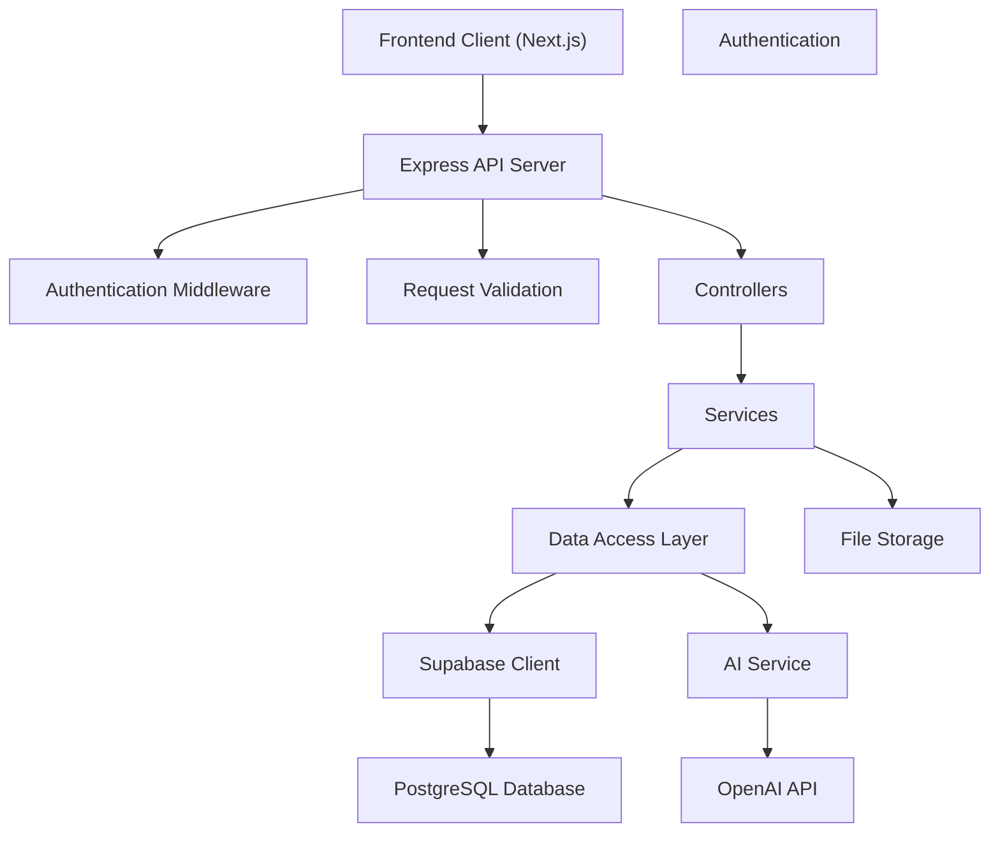
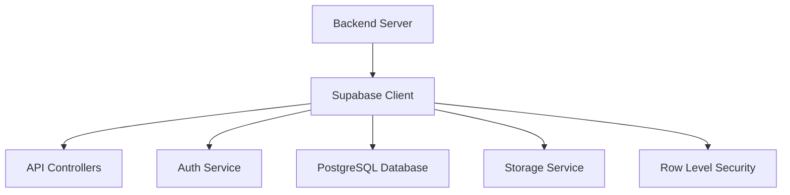
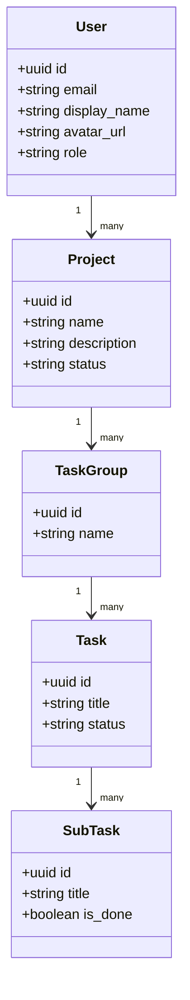

---
title: Backend Architecture
last_updated: 2025-04-28
---

# Relevant source files
The following files were used as context for generating this wiki page:

- docs/overview/database.md


# Backend Architecture

This document outlines the architecture of the Commit Coach backend system, including its components, data flow, API structure, and integration points. It focuses on server-side implementation, database interactions, and middleware functionality. For frontend architecture details, see **Frontend Architecture**, and for AI coaching implementation specifics, see **AI Coaching System**.

---

## Overview

The **Commit Coach backend** is built on a modern Node.js/Express stack with Supabase integration, providing a RESTful API that serves the Next.js frontend application. It manages project data, task hierarchies, user information, and integrates with OpenAI for AI coaching functionality.

### Architecture Diagram



---

## Core Components

### 2.1 Express API Server

The backend uses the **Express.js** framework to handle HTTP requests, routing, middleware integration, and response formatting. The server provides RESTful endpoints for:

- User authentication and profile management
- Project creation and management
- Task group, task, and subtask operations
- AI coaching interactions

---

### 2.2 Supabase Integration

Supabase serves as the primary backend-as-a-service platform providing:

* **PostgreSQL Database**: For storing application data with a relational schema
* **Authentication**: Handling user registration, login, and session management
* **Row Level Security (RLS)**: Enforcing data access policies at the database level
* **Storage**: For user avatars and other file assets



---

### 2.3 Authentication System

Authentication is implemented through **Supabase Auth**, with support for:

- **Email/password login**
- **OAuth providers** (GitHub, Google)
- **JWT tokens** for API requests
- **Role-based permissions** (user, admin)

Each authenticated request includes the user's JWT token, which is verified by middleware before processing.

---

### 2.4 AI Service Integration

The backend provides dedicated endpoints for AI coaching features by:

- Accepting user inputs from the frontend
- Enriching requests with relevant context (project data, tasks)
- Calling **OpenAI API** with properly formatted prompts
- Processing and returning AI responses
- Storing conversation history for context maintenance

---

## Data Model

The database follows a hierarchical structure for project and task management, with additional tables for AI interactions and user settings.

### Entity Relationship Diagram



---

## API Structure

The backend provides a comprehensive RESTful API organized by resource type.

### API Endpoints Overview

| Endpoint                | Method   | Description                                 |
|-------------------------|----------|---------------------------------------------|
| `/auth/login`           | POST     | User login                                 |
| `/auth/register`        | POST     | User registration                          |
| `/auth/logout`          | POST     | Logout current session                     |
| `/projects/:id`         | GET      | Get project by ID                          |
| `/projects/:id`         | PUT      | Update project                             |
| `/projects/:id`         | DELETE   | Delete project                             |
| `/task-groups/:id`      | GET      | Get task group by ID                       |
| `/tasks/:id`            | GET      | Get task by ID                             |
| `/tasks/:id/coach`      | POST     | Request AI coaching for task               |
| `/tasks/:id/breakdown`  | POST     | Request task breakdown                     |
| `/settings`             | GET/PUT  | Get and update user settings               |

---

## Security Implementation

### 5.1 Row Level Security (RLS)

Supabase's **Row Level Security** (RLS) provides database-level access controls:

- User data is only accessible to the user who owns it
- Project data is accessible to project owners
- Admin users have broader access permissions

Example RLS policy:

```sql
-- Projects table RLS
CREATE POLICY "Projects select" ON public.projects
  FOR SELECT USING (
    owner_id = auth.uid() OR auth.role() = 'admin'
  );
```

---

### 5.2 API Security Measures

The backend implements multiple layers of security:

| Security Measure       | Implementation                                 |
|------------------------|-------------------------------------------------|
| **Authentication**      | JWT tokens verified on each request            |
| **Authorization**       | Role-based access control (user/admin)         |
| **CORS Protection**     | Restricting requests to allowed origins        |
| **Input Validation**    | Sanitizing and validating all request data     |
| **Rate Limiting**       | Preventing excessive requests                  |
| **Error Handling**      | Preventing information leakage in errors      |

---

## Performance Considerations

### 6.1 Database Optimization

Several strategies enhance database performance:

- Strategic indexing on frequently queried columns
- Composite indexes for multi-column filtering
- Database connection pooling
- Query optimization and monitoring

### 6.2 Caching Strategy

The backend may implement caching for:

- Frequently accessed user settings
- Project metadata
- Static resources
- AI response templates

Cache implementation can use in-memory storage (for development) or dedicated caching services like Redis (for production).

---

## Integration with Frontend

The backend interfaces with the **Next.js** frontend through:

- **RESTful API**: Standard HTTP methods (GET, POST, PUT, DELETE)
- **Authentication Flow**: JWT tokens for session management
- **Real-time Updates**: Optional Supabase Realtime subscriptions
- **File Uploads**: Direct-to-Supabase storage uploads with backend-generated signed URLs

This separation of concerns allows the frontend and backend to evolve independently while maintaining clear integration points.

---

## Summary

The **Backend Architecture** of Commit Coach is built using modern web technologies, including **Node.js/Express** and **Supabase**. The system integrates with **OpenAI** for AI coaching functionality and provides a robust, secure, and scalable API for managing project data, user authentication, and task management. Performance optimizations, security measures, and caching strategies ensure the backend can handle complex interactions efficiently.
