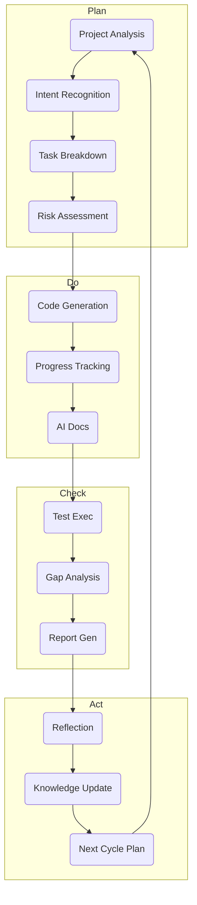
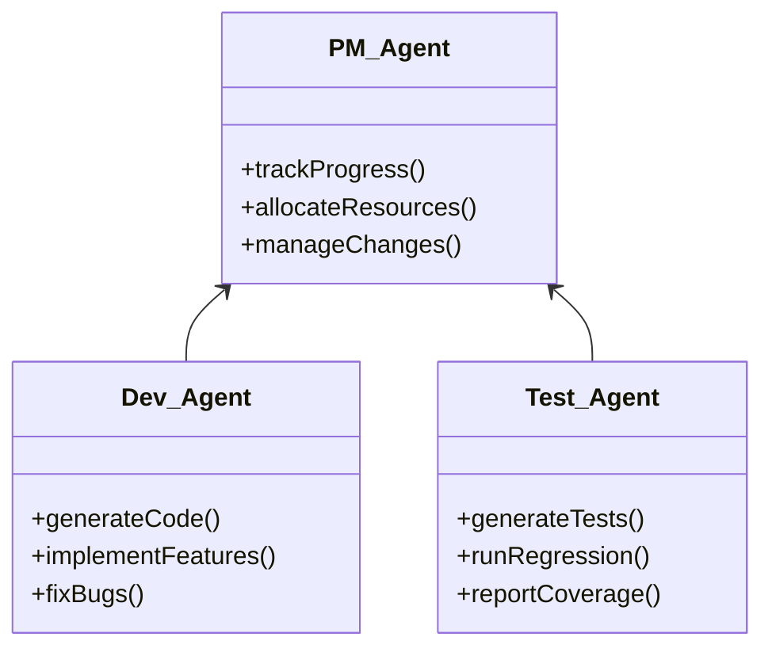
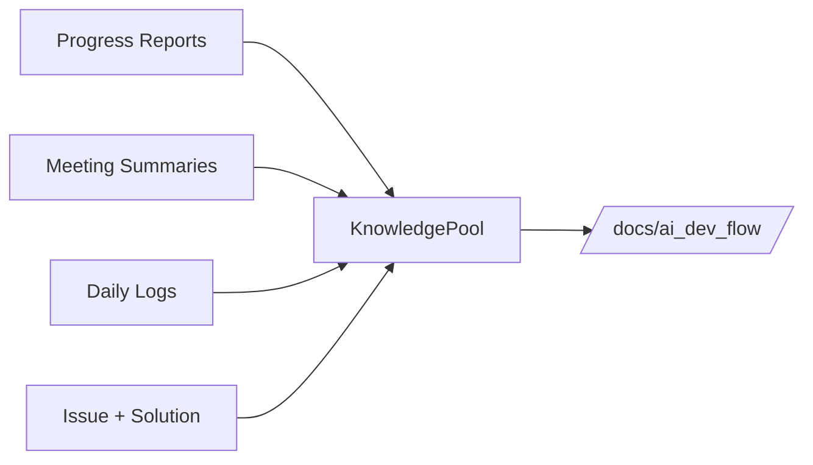

---
title: AI-Driven Development
last_updated: 2025-04-28
---

# AI-Driven Development

Commit Coach systematically embeds AI assistance into every stage of the software-development life-cycle.  
Traditional PDCA loops are turbo-charged with specialized AI agents, tooling, and knowledge-management practices.

---

# Relevant source files
The following files were used as context for generating this wiki page:

- docs/_pdca_prompt.md
- docs/overview/guideline.md
- docs/overview/guideline.pdf

---

## 1  Overview

* **AI in requirements** – intent recognition & task decomposition  
* **AI in coding** – generation, refactoring, docstrings  
* **AI in QA** – test-case synthesis, regression alerts  
* **AI in docs** – auto-written progress & meeting reports  

This bridges rigid waterfall phases with agile iteration by letting AI handle mundane transitions and rapid re-planning.

---

## 2  PDCA-Based AI Workflow



---

## 3  AI Agent Roles



| Agent | Responsibilities |
|-------|------------------|
| **PM Agent** | Milestones, resource allocation, requirement prioritization |
| **Development Agent** | Code generation, refactors, standards adherence |
| **Test Agent** | Auto-tests, regression, coverage analytics |

---

## 4  Tooling Stack

| Tool | Purpose |
|------|---------|
| **Cursor** | VS-Code-based editor with inline LLM commands |
| **Composer (Cursor)** | Multi-step prompt workflows (e.g., “scaffold component → write tests → doc”) |
| **cursorrules** | Repo-level rules: naming, directory, coding standards |

---

## 5  Knowledge Management



* **Front-matter** on every doc: path, title, description  
* AI autogenerates reports → stored under `/knowledge_pool/progress_reports_byAI/`  
* Human thought logs live in `/thinking_logs/`

---

## 6  Implementation Workflow

1. **Requirement capture** → stored in `/docs/overview/`  
2. **PM Agent** decomposes into tasks → issues / TODOs  
3. **Dev Agent** generates code → PR opened  
4. **Test Agent** attaches test-suite → CI executes Jest/Supertest/Cypress  
5. Outcomes feed **Check** → **Act** updates knowledge base & cursorrules.

---

## 7  Benefits vs Challenges

| ✅ Benefit | ⚠️ Challenge | Mitigation |
|-----------|--------------|------------|
| Speedy code & docs | Variable AI output quality | Mandatory human review |
| Consistent standards | API usage cost | Usage monitoring, prompt reuse |
| Rich documentation | Learning curve | Pair-programming, workshops |
| Adaptive planning | Over-reliance | “Human-in-the-loop” checkpoints |

---

## 8  Future Directions

* Tighter agent orchestration for end-to-end feature delivery  
* Advanced requirement-to-test traceability via AI  
* IDE plugins for real-time PDCA hints  
* Metrics dashboard tracking AI contribution (%) to commits and LOC  

---

## Summary

Commit Coach’s AI-driven development weds PDCA discipline with specialized agents and Editor-integrated tooling, yielding faster iterations, richer documentation, and resilient knowledge capture—while keeping humans firmly in control of final quality.
```

このファイルを追加すれば、DeepWiki／GitHub 上で自動レンダリングされます。さらに深掘りしたい章や図の修正があればご連絡ください！