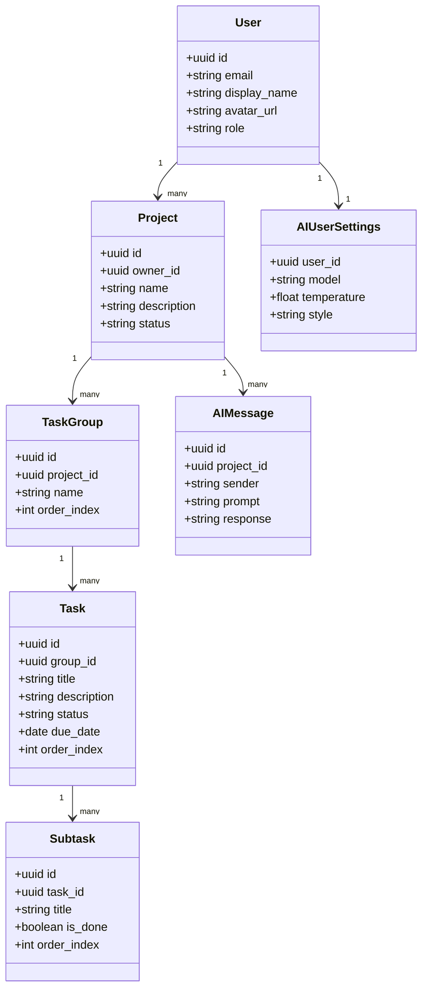

---
title: Database Schema
last_updated: 2025-04-28
---

# Database Schema

This document provides a detailed overview of the database schema used in the **Commit Coach** system. It covers the tables, relationships, indexes, and security policies that form the data storage foundation for the application. For information about how **Supabase** services are integrated with this schema, see **Supabase Integration**.

---

# Relevant source files
The following files were used as context for generating this wiki page:

- docs/overview/database.md
- docs/overview/types.md

---

## Database Overview

**Commit Coach** uses **Supabase** (PostgreSQL) as its database platform. The schema follows a hierarchical structure to support the core task management functionality while incorporating specialized tables for AI coaching features.

### Key Characteristics of the Database Design:

- Fully relational model with proper foreign key constraints
- Row Level Security (RLS) policies for data isolation and security
- Optimized indexing for common query patterns
- Support for real-time updates via **Supabase Realtime**

The database is designed to maintain strict boundaries between user data, ensuring that users can only access their own projects, tasks, and AI interactions.

---

## Entity Relationship Diagram



---

## Table Definitions

### 3.1 **users** Table

The **users** table stores information about registered users, including authentication details and profile information.

| Column       | Type         | PK/FK  | Required | Default           | Description                               |
|--------------|--------------|--------|----------|-------------------|-------------------------------------------|
| `id`         | UUID         | PK     | Yes      | `gen_random_uuid()`| Primary key, linked to Supabase Auth UID |
| `email`      | VARCHAR(255)  | UNIQUE | Yes      |                   | Authentication email address              |
| `display_name`| VARCHAR(100) |        | Yes      |                   | User display name                         |
| `avatar_url` | VARCHAR(512)  |        | No       |                   | Profile image URL                         |
| `role`       | VARCHAR(20)   |        | Yes      | `'user'`          | Role (e.g., user/admin)                   |
| `created_at` | TIMESTAMPTZ   |        | No       | `now()`           | Record creation timestamp                 |
| `updated_at` | TIMESTAMPTZ   |        | No       | `now()`           | Last update timestamp                     |

**Indexes:**
- `email` (UNIQUE)
- `role`

**RLS Policy:**
- Users can only read and write their own records (matching `id`), except for admins who have access to all records.

---

### 3.2 **projects** Table

The **projects** table contains project information. Each project belongs to a user who is the project owner.

| Column        | Type         | PK/FK  | Required | Default           | Description                               |
|---------------|--------------|--------|----------|-------------------|-------------------------------------------|
| `id`          | UUID         | PK     | Yes      | `gen_random_uuid()`| Project ID                                |
| `owner_id`    | UUID         | FK → users.id | Yes |                   | Owner user ID                             |
| `name`        | VARCHAR(255)  |        | Yes      |                   | Project name                              |
| `description` | TEXT         |        | No       |                   | Project description                       |
| `status`      | VARCHAR(20)   |        | Yes      | `'active'`        | Status (active/paused/archived)           |
| `created_at`  | TIMESTAMPTZ   |        | No       | `now()`           | Creation timestamp                        |
| `updated_at`  | TIMESTAMPTZ   |        | No       | `now()`           | Update timestamp                          |

**Indexes:**
- `owner_id`
- `status`

**Foreign Key Constraint:**
- `owner_id → users(id)` ON DELETE CASCADE

**RLS Policy:**
- Access is restricted to the project owner or admins.

---

### 3.3 **task_groups** Table

The **task_groups** table represents groups of related tasks within a project, such as columns in a Kanban board.

| Column       | Type         | PK/FK  | Required | Default           | Description                               |
|--------------|--------------|--------|----------|-------------------|-------------------------------------------|
| `id`         | UUID         | PK     | Yes      | `gen_random_uuid()`| Task group ID                            |
| `project_id` | UUID         | FK → projects.id | Yes |                   | Parent project ID                        |
| `name`       | VARCHAR(100)  |        | Yes      |                   | Group name                                |
| `order_index`| INTEGER      |        | Yes      | `0`               | Display order                             |
| `created_at` | TIMESTAMPTZ   |        | No       | `now()`           | Creation timestamp                        |
| `updated_at` | TIMESTAMPTZ   |        | No       | `now()`           | Update timestamp                          |

**Indexes:**
- `(project_id, order_index)`

**Foreign Key Constraint:**
- `project_id → projects(id)` ON DELETE CASCADE

---

### 3.4 **tasks** Table

The **tasks** table stores individual tasks that belong to task groups.

| Column       | Type         | PK/FK  | Required | Default           | Description                               |
|--------------|--------------|--------|----------|-------------------|-------------------------------------------|
| `id`         | UUID         | PK     | Yes      | `gen_random_uuid()`| Task ID                                  |
| `group_id`   | UUID         | FK → task_groups.id | Yes |                   | Parent task group ID                      |
| `title`      | VARCHAR(255)  |        | Yes      |                   | Task title                                |
| `description`| TEXT         |        | No       |                   | Task description                          |
| `status`     | VARCHAR(20)   |        | Yes      | `'pending'`       | Status (pending/in_progress/completed)    |
| `due_date`   | DATE         |        | No       |                   | Deadline date                             |
| `order_index`| INTEGER      |        | Yes      | `0`               | Display order                             |
| `created_at` | TIMESTAMPTZ   |        | No       | `now()`           | Creation timestamp                        |
| `updated_at` | TIMESTAMPTZ   |        | No       | `now()`           | Update timestamp                          |

**Indexes:**
- `(group_id, order_index)`
- `status`

**Foreign Key Constraint:**
- `group_id → task_groups(id)` ON DELETE CASCADE

---

### 3.5 **subtasks** Table

The **subtasks** table contains smaller task components that belong to a parent task.

| Column       | Type         | PK/FK  | Required | Default           | Description                               |
|--------------|--------------|--------|----------|-------------------|-------------------------------------------|
| `id`         | UUID         | PK     | Yes      | `gen_random_uuid()`| Subtask ID                                |
| `task_id`    | UUID         | FK → tasks.id | Yes |                   | Parent task ID                            |
| `title`      | VARCHAR(255)  |        | Yes      |                   | Subtask title                             |
| `is_done`    | BOOLEAN      |        | Yes      | `false`           | Completion flag                           |
| `order_index`| INTEGER      |        | Yes      | `0`               | Display order                             |
| `created_at` | TIMESTAMPTZ   |        | No       | `now()`           | Creation timestamp                        |
| `updated_at` | TIMESTAMPTZ   |        | No       | `now()`           | Update timestamp                          |

**Indexes:**
- `(task_id, order_index)`
- `is_done`

**Foreign Key Constraint:**
- `task_id → tasks(id)` ON DELETE CASCADE

---

## Row Level Security (RLS) Policies

Commit Coach utilizes **Supabase's Row Level Security** to enforce access control at the database level. This ensures that users can only access data they own or have been granted permission to view.

### Sample RLS Policy Implementations

```sql
-- Users table
CREATE POLICY "Users must be owner" ON public.users
  FOR ALL USING ( auth.uid() = id OR auth.role() = 'admin' );

-- Projects table
CREATE POLICY "Projects select" ON public.projects
  FOR SELECT USING (
    owner_id = auth.uid() OR auth.role() = 'admin'
  );
CREATE POLICY "Projects modify" ON public.projects
  FOR INSERT, UPDATE, DELETE USING (
    owner_id = auth.uid() OR auth.role() = 'admin'
  );

-- AI messages table
CREATE POLICY "AI messages select" ON public.ai_messages
  FOR SELECT USING (
    project_id IN (
      SELECT id FROM public.projects 
      WHERE owner_id = auth.uid() OR auth.role() = 'admin'
    )
  );
```

---

## Indexes and Performance Optimization

The database schema includes carefully designed indexes to optimize query performance for common access patterns.

| Table         | Indexed Columns                           | Purpose                                         |
|---------------|--------------------------------------------|-------------------------------------------------|
| **users**     | `email` (UNIQUE), `role`                   | Authentication lookups, role filtering          |
| **projects**  | `owner_id`, `status`                       | Owner filtering, status filtering               |
| **task_groups**| `(project_id, order_index)`               |