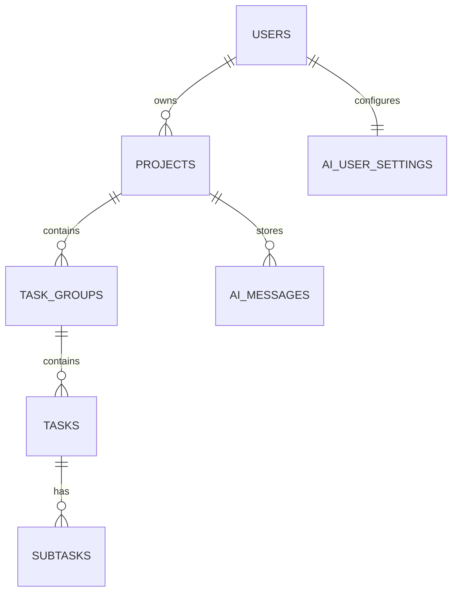
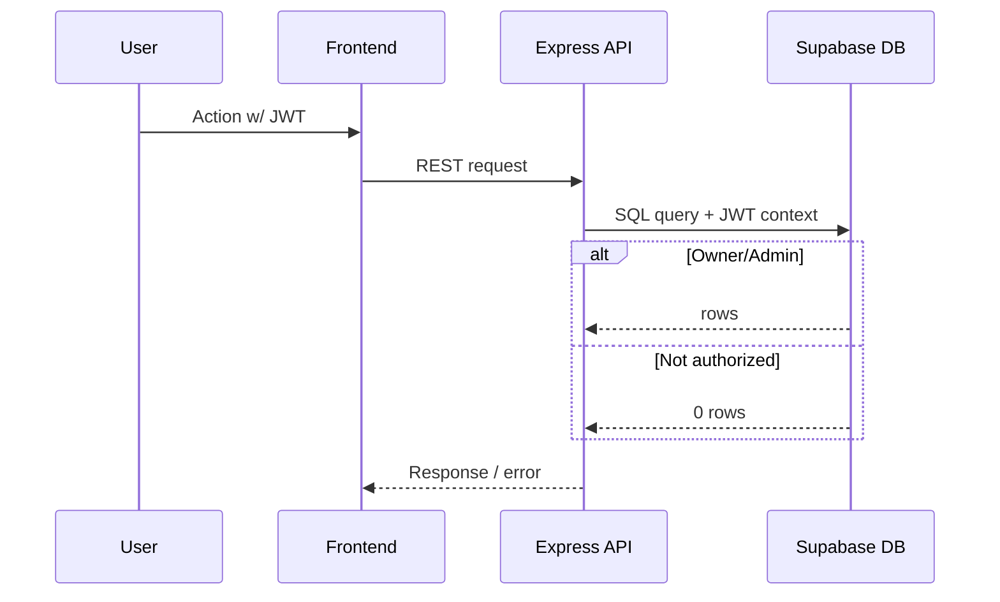
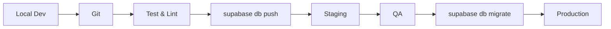

---
title: Supabase Integration
last_updated: 2025-04-28
---

# Supabase Integration

This document explains how **Commit Coach** integrates with **Supabase** for authentication, data persistence, storage, and realtime services. For the full database schema, see **Database Schema**; for the API layer that consumes Supabase, see **API Routes & Endpoints**.

---

# Relevant source files

The following files were used as context for generating this wiki page:
- docs/overview/database.md

---

## 1  Supabase Architecture Overview

```mermaid
graph TD
    Client["Next.js Frontend"]
    Backend["Node.js / Express"]
    SupabaseAuth["Supabase Auth"]
    Postgres["PostgreSQL DB"]
    Storage["Supabase Storage"]
    Realtime["Realtime Subscriptions"]
    RLS["Row Level Security"]
    JWT["JWT Tokens"]
    
    Client -->|email / OAuth| SupabaseAuth
    SupabaseAuth -->|JWT| Client
    Client -->|REST calls + JWT| Backend
    Backend -->|supabase-js (service key)| Postgres
    Backend -->|AI queries| OpenAIAPI[(OpenAI API)]
    
    Postgres --> RLS
    Client -- Realtime --> Realtime
    Storage -. optional .- Client
```

---

## 2  Supabase Services Utilized

### 2.1 Authentication

* Email / password & OAuth (GitHub, Google)  
* JWT generation / refresh  
* Session management  
* Tight coupling with **RLS** for row-level access control.

### 2.2 Database

* Fully relational hierarchy — projects → groups → tasks → subtasks  
* RLS enforced at table level (see §4)  
* Indexes tuned for common filters (`owner_id, status`, etc.).

### 2.3 Storage (optional)

Used for:

* Avatar images  
* Future project attachments

### 2.4 Realtime Subscriptions

* Live task updates  
* Collaborative editing signals  
* Notifications channel for AI-generated hints

---

## 3  Database Schema Architecture

(See full schema for column details.)



---

## 4  Security Implementation

### 4.1 Row Level Security (RLS)



Example policy (projects):

```sql
CREATE POLICY "Projects owner or admin"
ON public.projects
FOR ALL USING (
  owner_id = auth.uid() OR auth.role() = 'admin'
);
```

### 4.2 API Security Layers

| Layer          | Technique                       |
|----------------|---------------------------------|
| Transport      | HTTPS enforced                  |
| AuthN          | Supabase JWT                    |
| AuthZ          | RLS + role checks               |
| Rate-limiting  | `express-rate-limit` middleware |
| Input sanity   | Zod validation                  |

---

## 5  Integration Patterns

### 5.1 Client-Side (`supabase-js`)

```typescript
import { createClient } from '@supabase/supabase-js';

export const supabase = createClient(
  process.env.NEXT_PUBLIC_SUPABASE_URL!,
  process.env.NEXT_PUBLIC_SUPABASE_ANON_KEY!
);

// Auth
await supabase.auth.signInWithPassword({ email, password });

// Query
const { data } = await supabase
  .from('tasks')
  .select('*')
  .eq('group_id', groupId)
  .order('order_index');
```

* Realtime: `supabase.channel('projects')` → `on('postgres_changes', …)`  
* File upload: `supabase.storage.from('avatars').upload(...)`

### 5.2 Backend (`service role`)

Server code uses the secret **service key** for elevated privileges (migration, cron jobs, AI aggregation).

---

## 6  Environment-Specific Configurations

| Environment | Supabase Project | Key Points                      |
|-------------|------------------|---------------------------------|
| **Dev**     | Free tier / local| Shared creds, open CORS         |
| **Prod**    | Paid plan        | Strict RLS, IP allow-list, backups|

Environment variables:

```bash
SUPABASE_URL=https://xyz.supabase.co
SUPABASE_ANON_KEY=public-*
SUPABASE_SERVICE_ROLE_KEY=secret-*
```

---

## 7  Migration Workflow



* SQL files live in `/supabase/migrations`  
* Immutable, timestamp-prefixed filenames  
* Rollback via `supabase db reset -p <file>` if needed

---

## 8  Non-Functional Requirements

* **Availability** — automatic backups, optional multi-region  
* **Performance** — strategic indexes, connection pooling  
* **Monitoring** — Supabase logs → Grafana / Loki stack  
* **Security** — periodic RLS audits, key rotation

---

## 9  Future Extensions

1. **Edge Functions** for webhook processing & notifications  
2. GitHub / GitLab tables for commit → task linking  
3. Advanced caching layer (Redis) for heavy analytics  
4. Fine-grained billing / quota tables

---

## 10  Technical Considerations

| Topic          | Note                                                   |
|----------------|--------------------------------------------------------|
| Portability    | Limit Supabase-specific SQL; wrap in repository layer  |
| Secrets        | Use `.env` + GitHub Secrets; never commit keys         |
| CSRF / XSS     | Rely on NextAuth + strict CORS headers                 |
| Vendor lock-in | Maintain optional Prisma schema for alternative DB     |

---

## Summary

Supabase provides Commit Coach with an integrated platform for **authentication**, **PostgreSQL storage**, **row-level security**, **file storage**, and **realtime updates**. By combining Supabase’s capabilities with an Express API layer and a modern Next.js frontend, Commit Coach achieves a secure, scalable, and developer-friendly infrastructure while remaining flexible for future expansion.
```

保存後、図は GitHub/DeepWiki/MkDocs (mermaid プラグイン有効) で自動レンダリングされます。追加の詳細や修正が必要なら教えてください！