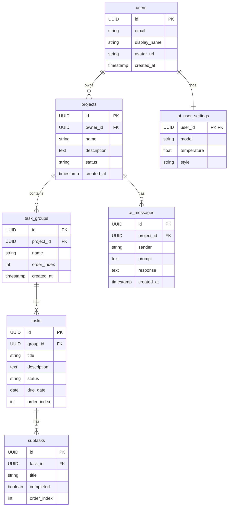

# Commit Coach システム概要
https://deepwiki.com/ttaarroo77/commit_coach_ver02/1-overview

## システムの目的
Commit Coachは、伝統的なプロジェクト管理ツールとAIコーチング機能を組み合わせた現代的なタスク管理アプリケーションです。ユーザーはプロジェクトの作成、タスクのグループ化、進捗の追跡、そしてAIを活用したプロジェクト計画やタスク分解の支援を受けることができます。

## システムアーキテクチャ

### コアコンポーネント
- **ブラウザクライアント**
- **フロントエンド** (Next.js)
- **バックエンド** (Express)
- **Supabaseデータベース**
- **OpenAI API**

### 主要機能
- プロジェクト管理
- タスク管理
- AIコーチング
- ユーザー管理

### 技術スタック
| コンポーネント | 技術 | 主な役割 |
|---------------|------|----------|
| フロントエンド | Next.js | ユーザーインターフェースとクライアントサイドロジック |
| バックエンド | Node.js/Express | APIエンドポイントとビジネスロジック |
| データベース | Supabase (PostgreSQL) | データ永続化と認証 |
| AI統合 | OpenAI API | AIコーチングとタスク分解 |

## データモデル

### 主要エンティティ
1. **ユーザー** (`users`)
2. **プロジェクト** (`projects`)
3. **タスクグループ** (`task_groups`)
4. **タスク** (`tasks`)
5. **サブタスク** (`subtasks`)
6. **AIメッセージ** (`ai_messages`)
7. **AIユーザー設定** (`ai_user_settings`)

## ユーザーワークフロー
1. プロジェクト作成
2. タスクグループの追加
3. タスクの追加
4. 進捗の追跡
5. AI支援のリクエスト
6. サブタスクの追加
7. タスクの更新
8. プロジェクトの完了

## フロントエンドコンポーネント構造
- **Next.jsアプリケーション**
  - ページ
    - ダッシュボード
    - プロジェクト
    - 設定
  - 再利用可能なコンポーネント
    - プロジェクトテンプレート
    - タスクグループ
    - タスクカード
    - AIチャットウィジェット
    - サブタスクリスト

## バックエンドAPI構造
```
/api
├── /auth
├── /projects (CRUD)
├── /tasks (CRUD)
├── /task-groups (CRUD)
├── /ai
│   ├── /coach
│   ├── /breakdown
│   └── /settings
└── /users
```

## AI統合
Commit Coachは2つの主要な方法でAIを統合しています：

1. **ユーザー向け**
   - AIチャットウィジェットを通じたコーチング
   - タスク分解支援

2. **開発向け**
   - システム自体の構築にAI駆動の開発プロセスを採用

### AIコーチングシステムの流れ
1. ユーザーがAI支援をリクエスト
2. バックエンドAPIにPOSTリクエスト
3. コンテキストを含むプロンプトを送信
4. AIレスポンスを返却
5. フォーマットされたレスポンスを表示

## 開発手法
Commit Coachは、AI支援を組み合わせた伝統的なウォーターフォール手法を使用して構築されています。このアプローチは以下を重視します：

- コーディング前の明確な要件定義
- AI支援によるコード生成
- 構造化されたディレクトリ構成
- テスト自動化
- 改善のためのPDCAサイクル

### AIエージェントの役割
- **PMエージェント**: 進捗管理とリソース配分
- **開発エージェント**: 要件に基づくコード生成
- **テストエージェント**: 自動テスト生成と実行

## 次のステップ
詳細情報については、以下のドキュメントを参照してください：

- [プロジェクト目標と機能](./project_goals.md)
- [フロントエンドアーキテクチャ](./frontend_architecture.md)
- [バックエンドアーキテクチャ](./backend_architecture.md)
- [AIコーチングシステム](./ai_coaching.md)
- [開発とデプロイ](./development_deployment.md)

---

## 追記：Mermaid ER図 (データモデル)


