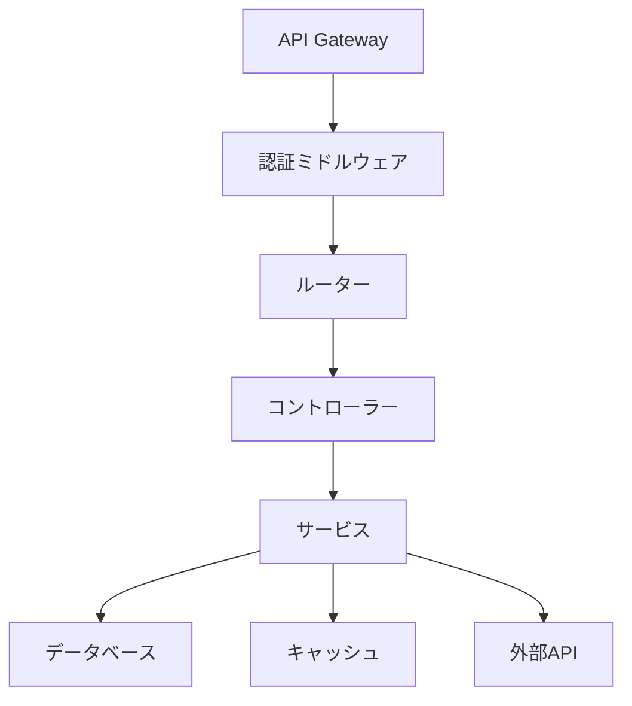

# バックエンドアーキテクチャ

## 概要
Commit Coachのバックエンドは、Node.jsとExpressを使用して構築されたRESTful APIです。このアーキテクチャは、スケーラビリティ、セキュリティ、および保守性を重視しています。

## 技術スタック
| カテゴリ | 技術 | 目的 |
|----------|------|------|
| ランタイム | Node.js | JavaScript実行環境 |
| フレームワーク | Express | Webアプリケーションフレームワーク |
| データベース | PostgreSQL | リレーショナルデータベース |
| ORM | Prisma | データベースアクセスとマイグレーション |
| 認証 | JWT | ユーザー認証と認可 |
| キャッシュ | Redis | パフォーマンス最適化 |
| テスト | Jest & Supertest | ユニットテストと統合テスト |
| ロギング | Winston | アプリケーションログ |
| モニタリング | Prometheus & Grafana | システム監視 |

## アーキテクチャ図


## データモデル
```prisma
model User {
  id        String   @id @default(uuid())
  email     String   @unique
  password  String
  name      String?
  createdAt DateTime @default(now())
  updatedAt DateTime @updatedAt
}

model Project {
  id          String   @id @default(uuid())
  name        String
  description String?
  userId      String
  user        User     @relation(fields: [userId], references: [id])
  tasks       Task[]
  createdAt   DateTime @default(now())
  updatedAt   DateTime @updatedAt
}

model Task {
  id          String   @id @default(uuid())
  title       String
  description String?
  status      String   @default("todo")
  projectId   String
  project     Project  @relation(fields: [projectId], references: [id])
  subtasks    SubTask[]
  createdAt   DateTime @default(now())
  updatedAt   DateTime @updatedAt
}
```

## 主要コンポーネント

### API Gateway
- リクエストのルーティング
- レート制限
- リクエストの検証
- エラーハンドリング

### 認証ミドルウェア
- JWTトークンの検証
- ユーザー認証
- アクセス制御

### コントローラー
- リクエストの処理
- レスポンスの生成
- エラーハンドリング

### サービス
- ビジネスロジックの実装
- データベース操作
- キャッシュ管理
- 外部APIとの連携

## セキュリティ対策
- JWTによる認証
- パスワードのハッシュ化
- CORS設定
- レート制限
- 入力値の検証
- SQLインジェクション対策

## パフォーマンス最適化
- Redisによるキャッシュ
- データベースのインデックス
- クエリの最適化
- レスポンスの圧縮
- 非同期処理

## エラーハンドリング
- グローバルエラーハンドラー
- カスタムエラークラス
- エラーログ
- エラーレスポンスの標準化

## ロギングとモニタリング
- アプリケーションログ
- エラーログ
- パフォーマンスメトリクス
- アラート設定

## テスト戦略
- ユニットテスト
- 統合テスト
- APIテスト
- パフォーマンステスト

## デプロイメント
- Dockerコンテナ化
- CI/CDパイプライン
- 環境変数管理
- ロールバック戦略

## 結論
このアーキテクチャは、スケーラブルで安全なバックエンドAPIを実現します。モダンな技術スタックと明確なコンポーネント構造により、効率的な開発と運用が可能です。 