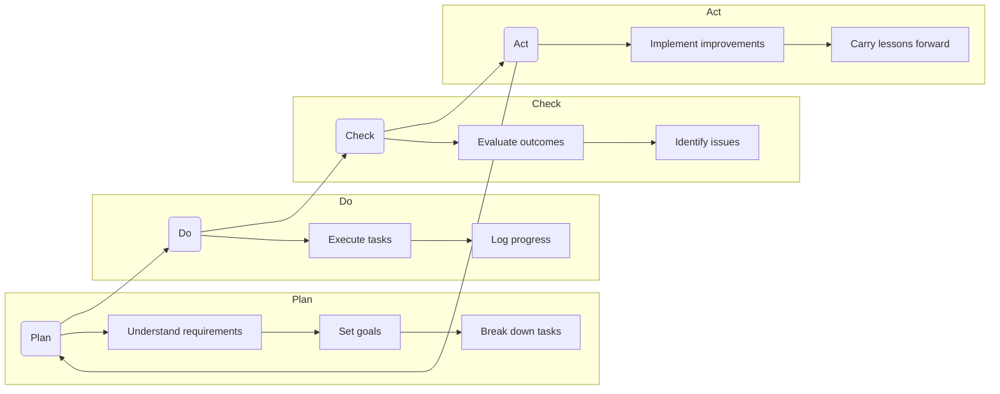
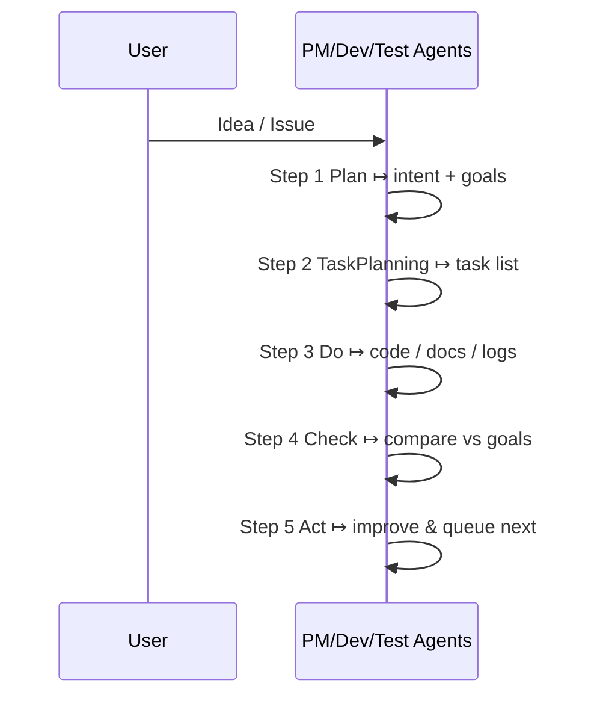
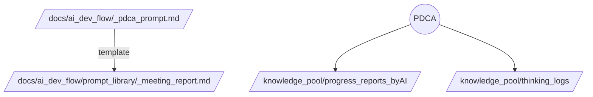
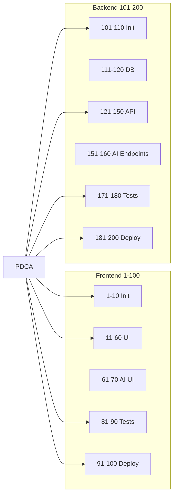

# PDCA Development Cycle

Commit Coach applies the classic **Plan-Do-Check-Act** loop—augmented with AI agents—to drive continuous improvement across >200 structured development steps.  
For overarching DevOps details, see **Development & Deployment**; for AI tooling, see **AI-Driven Development**.

---


# Relevant source files
The following files were used as context for generating this wiki page:

- docs/_pdca_prompt.md
- docs/overview/development_flow.md

---


## 1  PDCA Cycle Overview



---

## 2  Minimal PDCA Flow (per task)



---

## 3  Detailed Phase Activities

| Phase | Key Activities | AI Support |
|-------|----------------|------------|
| **Plan** | Requirement analysis, goal setting, risk assessment | Intent recognition, task decomposition |
| **Do** | Implementation, progress logging | Code generation, doc scaffolding |
| **Check** | Testing, review, gap analysis | Test-case generation, metrics |
| **Act** | Refactor, knowledge update | Improvement suggestions, doc updates |

---

## 4  Documentation & File Structure Integration



* Every doc starts with YAML front-matter:

```yaml
---
name: "knowledge_pool/progress_reports_byAI/2025-04-28_proj_RPT.md"
title: "Daily Progress Report"
description: "Auto-generated summary"
---
```

* AI logs progress → saved under `progress_reports_byAI/` with `YYYY-MM-DD_CODE_RPT.md`.

---

## 5  Integration with 200-Step Dev Flow



---

## 6  AI-Enhanced PDCA Matrix

| PDCA | AI Mechanism | Example in Commit Coach |
|------|--------------|-------------------------|
| **Plan** | Requirement parsing | Extract goals from `/docs/overview/` |
| **Do** | Code / template gen | Scaffold React component + Jest test |
| **Check** | Auto-testing | Jest & Cypress suites via Test Agent |
| **Act** | Refactor + docs | AI suggests code clean-up; updates docs |

---

## 7  Best-Practice Guidelines

1. **Keep tasks atomic** – easy to Check.  
2. **Log everything** – AI progress + human comments.  
3. **Review AI output** – human approval gate.  
4. **Carry over issues** – unresolved items feed next Plan.  

---

## Summary

The **PDCA Development Cycle** anchors Commit Coach’s workflow, ensuring every change passes through a tight Plan-Do-Check-Act loop—boosted by AI for speed and knowledge capture. Continuous improvement becomes an automated, traceable habit.
```

図は GitHub／DeepWiki／MkDocs でレンダリングされます。追加の変更や図の調整があればお知らせください！