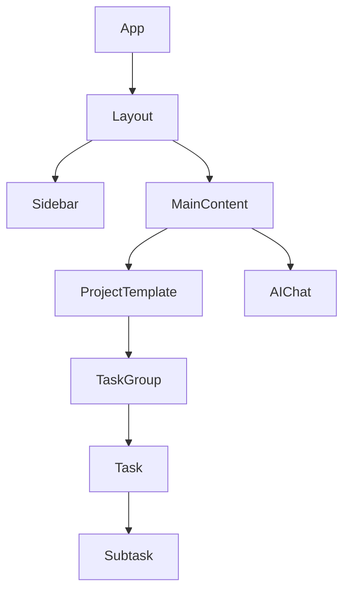

# フロントエンドアーキテクチャ

## 概要
Commit Coachのフロントエンドは、Next.jsを使用して構築されたモダンなWebアプリケーションです。このアーキテクチャは、ユーザーインターフェースの一貫性、パフォーマンス、および保守性を重視しています。

## 技術スタック
| カテゴリ | 技術 | 目的 |
|----------|------|------|
| フレームワーク | Next.js | サーバーサイドレンダリングとルーティング |
| UIライブラリ | React | コンポーネントベースのUI構築 |
| スタイリング | Tailwind CSS | ユーティリティファーストのCSS |
| 状態管理 | Zustand | 軽量な状態管理 |
| フォーム管理 | React Hook Form | フォームの状態管理とバリデーション |
| ドラッグ&ドロップ | react-beautiful-dnd | タスクの並べ替え機能 |
| テスト | Jest & React Testing Library | ユニットテストとコンポーネントテスト |

## コンポーネント階層


## データモデル
```typescript
interface ProjectTemplateProps {
  project: {
    id: string;
    name: string;
    description: string;
    taskGroups: TaskGroup[];
  };
}

interface TaskGroup {
  id: string;
  name: string;
  tasks: Task[];
  orderIndex: number;
}

interface Task {
  id: string;
  title: string;
  description: string;
  status: 'todo' | 'in_progress' | 'done';
  subtasks: SubTask[];
  orderIndex: number;
}

interface SubTask {
  id: string;
  title: string;
  isDone: boolean;
  orderIndex: number;
}
```

## 主要UIコンポーネント

### プロジェクトテンプレート
- プロジェクト全体のレイアウトを管理
- タスクグループのドラッグ&ドロップを処理
- プロジェクトの状態を管理

### タスクグループ
- タスクのグループ化と表示
- グループ内のタスクの並べ替え
- グループの追加/削除機能

### タスクカード
- タスクの詳細表示
- サブタスクの管理
- ステータス更新機能

### AIチャットウィジェット
- ユーザーとの対話インターフェース
- メッセージ履歴の表示
- プロンプト入力とレスポンス表示

## 状態管理
Zustandを使用して、以下の状態を管理します：

- プロジェクトデータ
- ユーザー設定
- UI状態（モーダル、サイドバーなど）
- AIチャットの状態

## ドラッグ&ドロップの実装
react-beautiful-dndを使用して、以下の機能を実装：

- タスクグループの並べ替え
- グループ内のタスクの並べ替え
- タスクのグループ間移動

## レスポンシブデザイン
Tailwind CSSを使用して、以下のブレークポイントでレスポンシブ対応：

- モバイル: < 640px
- タブレット: 640px - 1024px
- デスクトップ: > 1024px

## デザインシステム
一貫性のあるUIを実現するためのデザインシステム：

- カラーパレット
- タイポグラフィ
- スペーシング
- コンポーネントライブラリ

## AI統合
フロントエンドでのAI統合ポイント：

- チャットインターフェース
- タスク分解UI
- プログレス分析ダッシュボード

## アクセシビリティ
WCAG 2.1に準拠したアクセシビリティ対応：

- キーボードナビゲーション
- スクリーンリーダー対応
- カラーコントラスト
- ARIA属性

## 結論
このアーキテクチャは、スケーラブルで保守性の高いフロントエンドアプリケーションを実現します。モダンな技術スタックと明確なコンポーネント構造により、効率的な開発とテストが可能です。