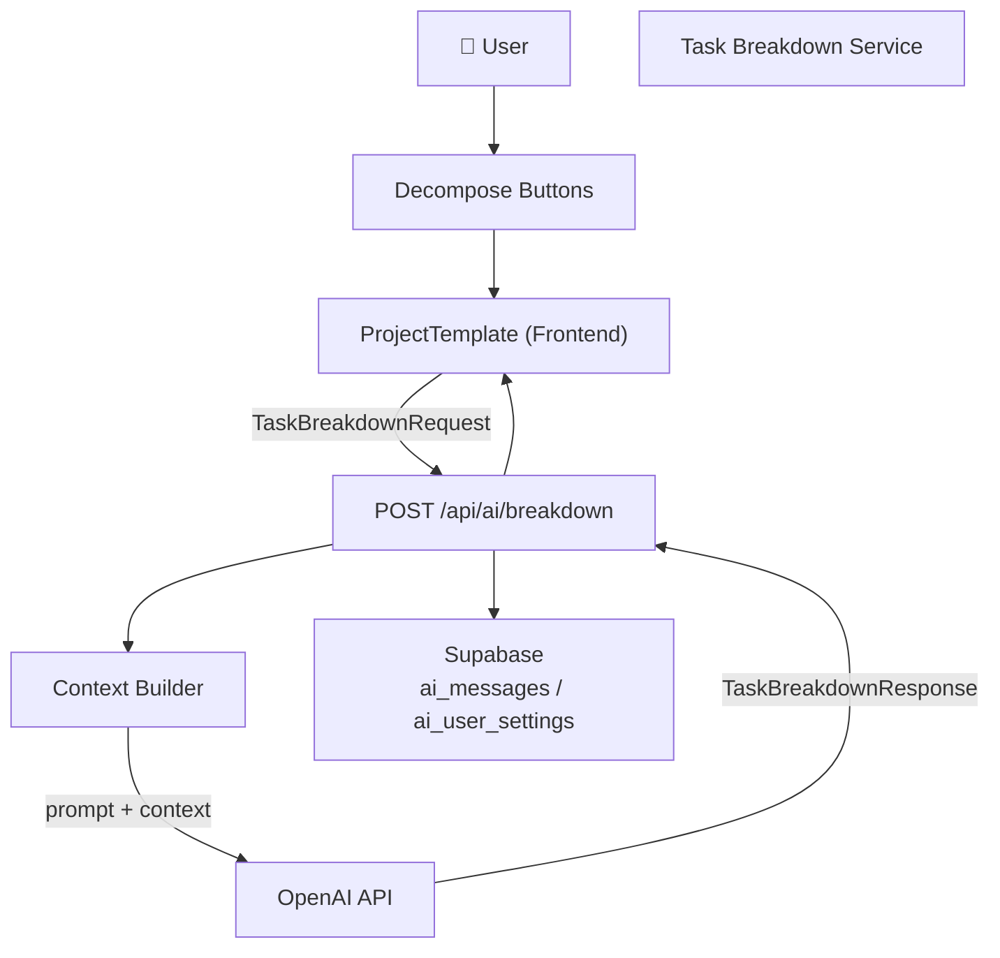
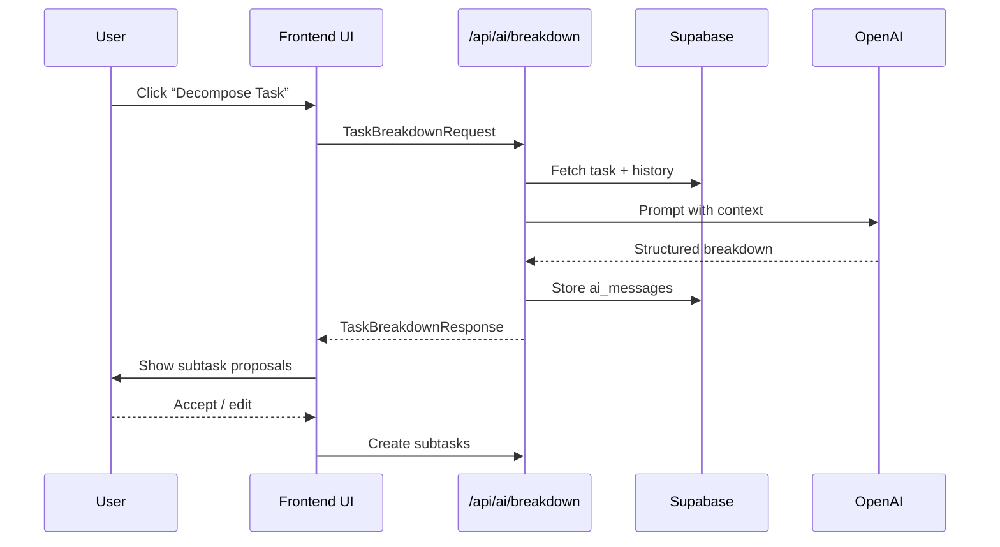
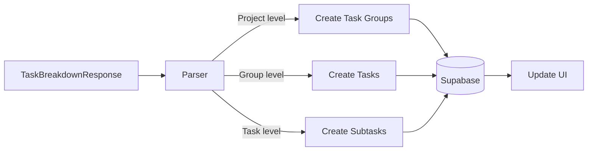

# Task Breakdown AI

The **Task Breakdown AI** automatically decomposes complex tasks into smaller, actionable subtasks, reducing user cognitive load and improving planning accuracy. For general coaching capabilities, see **AI Coaching System**.

---

# Relevant source files
The following files were used as context for generating this wiki page:

- docs/overview/types.md
- frontend/app/projects/project-template.tsx
- frontend/package.json


---

## 1  Purpose & Function

* Convert ambiguous work items into concrete steps  
* Ensure full coverage of required activities  
* Improve estimation and scheduling  
* Lower planning friction for large projects

---

## 2  System Architecture



---

## 3  Data Models & Interfaces

```typescript
export interface TaskBreakdownRequest {
  goal: string;               // Main objective
  constraints?: string[];     // Time, tech, etc.
  currentProgress?: string;   // Optional status
}

export interface TaskBreakdownProposal {
  title: string;
  description?: string;
  estimatedTime?: number;     // hours
  dependencies?: string[];
}

export interface TaskBreakdownResponse {
  breakdown: TaskBreakdownProposal[];
  explanation?: string;
  tokensUsed?: number;
}
```

---

## 4  Frontend Integration

### 4.1 Decomposition Triggers

| Level | Function | Source lines | UI icon |
|-------|----------|--------------|---------|
| **Project** | `decomposeProject()` | 792-794 | SplitSquareVertical |
| **Task Group** | `decomposeGroup()` | 840-843 | SplitSquareVertical |
| **Task** | `decomposeTask()` | 781-784 | SplitSquareVertical |

> Current implementation uses `alert()` placeholders. Replace with real API calls.

### 4.2 UI Elements

* **Project header** button – break project → task groups  
* **Task-group** header button – break group → tasks  
* **Task row** button – break task → subtasks  

---

## 5  Request / Response Flow



---

## 6  Implementation Details

### 6.1 Placeholder Functions

```typescript
const decomposeTask = (groupId: string, taskId: string) => {
  alert("AI によるタスク分解を開始します");
};
```

*Replace alerts with `fetch('/api/ai/breakdown', …)`.*

### 6.2 Prompt Engineering (conceptual)

1. **System role** – “You are a senior project planner …”  
2. **Context** – Goal, constraints, currentProgress, parent project info  
3. **Output spec** – JSON array of `{ title, description, estimatedTime }`  
4. **Examples** – Few-shot sample breakdowns  

---

## 7  Mapping AI Output → Entities



---

## 8  Best Practices

| Practice | Why |
|----------|-----|
| **Add context** | Better, relevant breakdowns |
| **Right granularity** | Avoid overly small / large subtasks |
| **Dependency hints** | Preserve execution order |
| **Editable results** | Empower user control |
| **Learn from edits** | Feed back into future prompts |

---

## 9  Limitations & Considerations

* Result quality depends on original task description.  
* AI may over-produce subtasks (“spec bloat”).  
* Domain-specific tasks might need custom prompt templates.  
* Very large tasks risk hitting token limits.  

---

## 10  Future Enhancements

1. **User-feedback learning** – refine with edit telemetry.  
2. **Methodology templates** – Agile, Waterfall, Design Sprint presets.  
3. **Time / resource estimation** – leverage historical data.  
4. **Calendar integration** – auto-schedule subtasks.  

---

## Summary

The **Task Breakdown AI** turns complex tasks into structured, actionable subtasks by combining project context, user constraints, and OpenAI’s language models. Tight UI integration and future backend endpoints will make this a cornerstone feature for streamlined project planning in Commit Coach.
```

保存後、Mermaid 図は DeepWiki／GitHub／MkDocs（Mermaid プラグイン有効）で自動描画されます。追加の修正や拡張要望があればお知らせください！