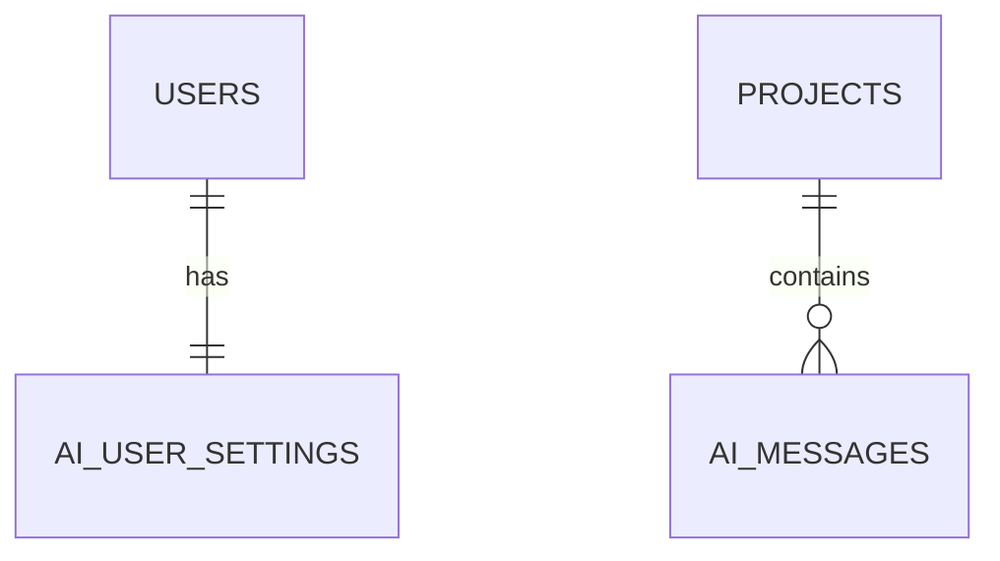

# AI Coaching System

The **AI Coaching System** is a core component of Commit Coach that leverages OpenAI language models to guide users through project planning, task breakdown, and productivity coaching.

---

# Relevant source files
The following files were used as context for generating this wiki page:

- docs/overview/types.md
- frontend/app/projects/project-template.tsx
- frontend/package.json

---

## 1  System Architecture

```mermaid
graph TD
    %% Interface layer
    User["👤 User"]
    ProjectTemplate["ProjectTemplate"]
    AIChat["AIChat Panel"]
    DecomposeBtns["AI Decomposition Buttons"]

    %% API / Services
    API["/api/ai/* Endpoints"]
    ContextSvc["Context Service"]
    OpenAIAPI["OpenAI API"]

    %% Storage
    MSG["ai_messages"]
    SETTING["ai_user_settings"]

    %% Flows
    User -->|asks| AIChat
    DecomposeBtns -->|triggers| API
    AIChat -->|prompt| API
    ProjectTemplate -->|context| ContextSvc
    API --> ContextSvc
    ContextSvc -->|✉ prompt+ctx| OpenAIAPI
    OpenAIAPI -->|completion| API
    API -->|store| MSG
    API -->|respect user prefs| SETTING
    API --> AIChat
```



---

## 2  Core Components

| Component | Purpose |
|-----------|---------|
| **AIChat** | Real-time chat UI for coaching |
| **AIMessage types** | Normalized request/response shapes (`AICoachRequest`, `AICoachResponse`) |
| **Decomposition fns** | `decomposeProject`, `decomposeGroup`, `decomposeTask` (UI triggers) |
| **Context Service** | Enriches prompts with project/task data + recent history |

---

## 3  Task Decomposition Features

```mermaid
sequenceDiagram
    participant U as User
    participant FE as Frontend (buttons)
    participant API as /api/ai/breakdown
    participant C as Context Service
    participant O as OpenAI
    
    U->>FE: Click “Split task”
    FE->>API: TaskBreakdownRequest(taskId)
    API->>C: Fetch task context
    C-->>API: Context JSON
    API->>O: Prompt + context
    O-->>API: Subtask suggestions
    API-->>FE: TaskBreakdownResponse
    FE->>U: Show editable subtasks
    U-->>FE: Accept
    FE->>API: POST /tasks (for each subtask)
```



---

## 4  AI Request Types

| Request | Input Payload | Output |
|---------|---------------|--------|
| **AICoachRequest** | `prompt`, `context` (project, history) | `assistantMessage`, `tokensUsed` |
| **TaskBreakdownRequest** | `taskId`, optional constraints | `subtasks[]`, reasoning |

All requests include the user’s **JWT** and are rate-limited.

---

## 5  UI Integration

### 5.1 Chat Panel

```jsx
<div className="w-96 border-l bg-gray-50 p-4">
  <h2 className="text-lg font-semibold mb-4">AI Coaching</h2>
  <AIChat />
</div>
```

### 5.2 Action Buttons

| Level | Function | Icon | Source lines |
|-------|----------|------|--------------|
| Project | `decomposeProject()` | `SplitSquareVertical` | 905-908 |
| TaskGroup | `decomposeGroup()` | `SplitSquareVertical` | 1044-1048 |
| Task | `decomposeTask()` | `SplitSquareVertical` | 1214-1217 |

---

## 6  Configuration & User Settings

```typescript
export interface AICoachSetting {
  model?: 'gpt-3.5-turbo' | 'gpt-4';
  temperature?: number;        // 0.0 – 1.0
  systemMessage?: string;      // custom persona
}
```

Stored per-user in **ai_user_settings** and injected into every prompt.

---

## 7  Database Tables



| Table | Key Columns | Purpose |
|-------|-------------|---------|
| **ai_messages** | `id`, `project_id`, `role`, `content` | Stores full chat history |
| **ai_user_settings** | `user_id` (PK) | Per-user model/temperature etc. |

---

## 8  Implementation Status

- ✅ Frontend UI (chat + buttons)  
- ✅ TypeScript DTOs  
- ⚠️ Placeholder `alert()` in decomposition fns → replace with real API calls  
- 🚧 Backend endpoints & OpenAI integration to be implemented  

---

## 9  Planned API Endpoints

| Endpoint | Method | Purpose |
|----------|--------|---------|
| `/api/ai/coach` | POST | General coaching |
| `/api/ai/breakdown` | POST | Task decomposition |
| `/api/ai/settings` | GET/PUT | Retrieve / update user AI prefs |

---

## 10  Next Steps for Devs

1. **Replace placeholders** with actual fetch to `/api/ai/*`.  
2. Implement server routes: validate JWT → gather context → call OpenAI → store `ai_messages`.  
3. Wire `ai_user_settings` CRUD in settings page.  
4. Add caching & token usage tracking.

---

## Summary

The **AI Coaching System** embeds OpenAI-powered assistance directly into Commit Coach’s workflow. By coupling project context, user preferences, and conversation history, it delivers tailored guidance and task breakdowns—all while preserving data isolation via Supabase RLS.
```

保存後、Mermaid 図は DeepWiki／GitHub／MkDocs で自動レンダリングされます。さらに詳細を追加したい場合や図形の修正が必要な場合はお知らせください！