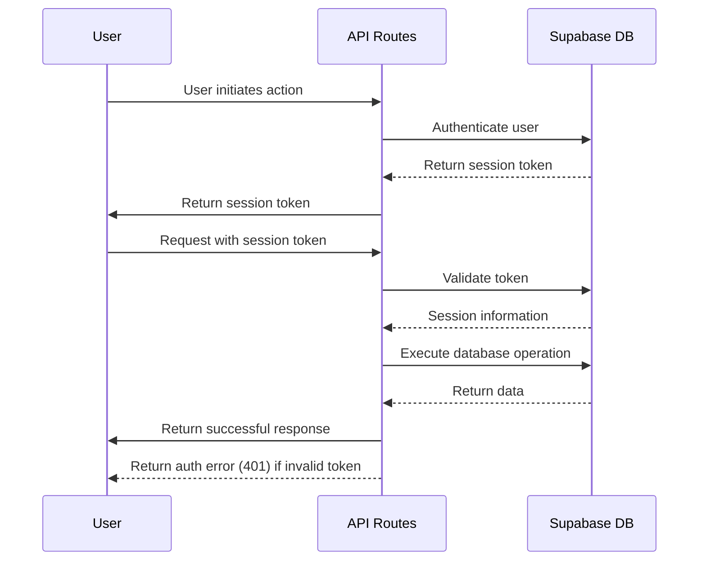
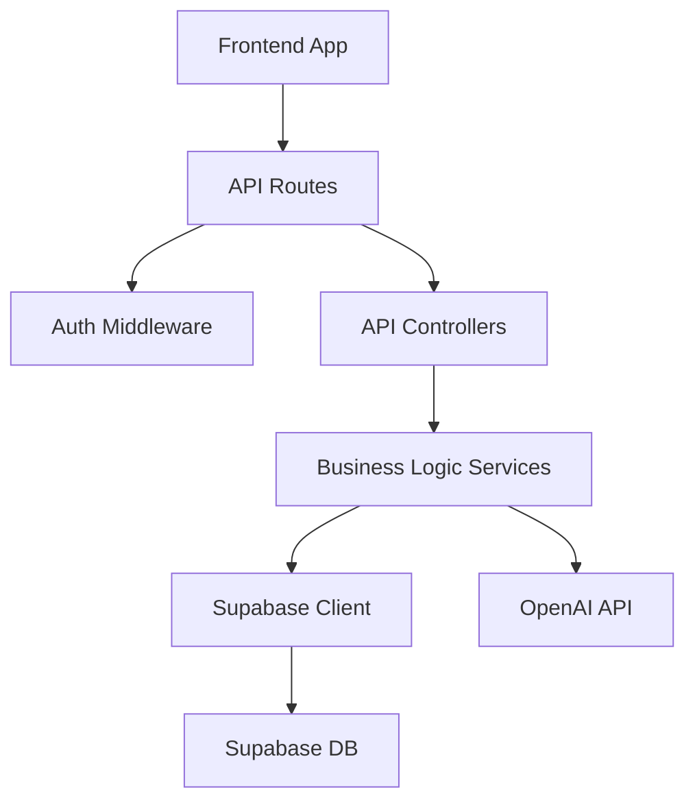

---
title: API Routes & Endpoints
last_updated: 2025-04-28
---

# Relevant source files
The following files were used as context for generating this wiki page:

- docs/overview/types.md

---

# API Routes & Endpoints

This document provides a comprehensive overview of the **Commit Coach API** routes and endpoints. It covers the RESTful API structure, request/response formats, authentication requirements, and usage patterns. For information about the database schema and data models, see **Database Schema**. For details about Supabase integration, refer to **Supabase Integration**.

---

## API Design Overview

The **Commit Coach API** follows RESTful design principles, with routes organized by resource type. The API is structured hierarchically, with each resource supporting standard CRUD operations. All endpoints return responses in a consistent format defined by the **ApiResponse<T>** interface.

### API Structure

```mermaid
graph TD
    api["/api"]
    auth["/auth"]
    projects["/projects"]
    tasks["/tasks"]
    taskGroups["/task-groups"]
    ai["/ai"]
    users["/users"]
    subtasks["/subtasks"]

    api --> auth
    api --> projects
    api --> tasks
    api --> taskGroups
    api --> ai
    api --> users
    api --> subtasks

    auth --> POST_login[POST /login]
    auth --> POST_logout[POST /logout]
    auth --> GET_session[GET /session]

    projects --> GET_projects[GET /projects]
    projects --> POST_create[POST /projects]
    projects --> GET_project[GET /projects/:id]
    projects --> PUT_update[PUT /projects/:id]
    projects --> DELETE_delete[DELETE /projects/:id]

    tasks --> GET_tasks[GET /tasks]
    tasks --> POST_create_task[POST /tasks]
    tasks --> GET_task[GET /tasks/:id]
    tasks --> PUT_update_task[PUT /tasks/:id]
    tasks --> DELETE_delete_task[DELETE /tasks/:id]

    taskGroups --> GET_task_groups[GET /task-groups]
    taskGroups --> POST_create_group[POST /task-groups]
    taskGroups --> GET_group[GET /task-groups/:id]
    taskGroups --> PUT_update_group[PUT /task-groups/:id]
    taskGroups --> DELETE_delete_group[DELETE /task-groups/:id]

    ai --> POST_coach[POST /ai/coach]
    ai --> POST_breakdown[POST /ai/breakdown]
    ai --> GET_settings[GET /ai/settings]
    ai --> PUT_update_settings[PUT /ai/settings]

    users --> GET_me[GET /users/me]
    users --> GET_user[GET /users/:id]
    users --> PUT_update_user[PUT /users/:id]

    subtasks --> GET_subtasks[GET /subtasks]
    subtasks --> POST_create_subtask[POST /subtasks]
    subtasks --> PUT_update_subtask[PUT /subtasks/:id]
    subtasks --> DELETE_delete_subtask[DELETE /subtasks/:id]
```



---

## Common Response Format

All API endpoints use a standardized response format defined by the **ApiResponse<T>** interface.

```typescript
interface ApiResponse<T> {
  success: boolean;
  data?: T;
  error?: ResponseError;
}

interface ResponseError {
  code: string;
  message: string;
  details?: Record<string, any>;
}
```

### Pagination Pattern

For endpoints that return collections of resources, a standard pagination pattern is implemented.

```typescript
interface PaginationParams {
  page?: number;
  perPage?: number;
  search?: string;
}

interface PaginatedResult<T> {
  items: T[];
  total: number;
  page: number;
  perPage: number;
}
```

---

## Authentication

Authentication is implemented using **Supabase**, with session-based token authentication. Most API endpoints require authentication, with the exception of public endpoints like login.

### Authentication Flow



---

## Resource Endpoints

### 4.1 Projects Endpoints

Projects are the top-level resources in the system hierarchy.

| Endpoint                | Method   | Description                                 | Authentication  | Request Body    | Response      |
|-------------------------|----------|---------------------------------------------|-----------------|-----------------|---------------|
| `/api/projects`          | GET      | List all projects for current user          | Required        | PaginationParams | PaginatedResult|
| `/api/projects`          | POST     | Create a new project                        | Required        | CreateProjectDto | Project       |
| `/api/projects/:id`      | GET      | Get project by ID                           | Required        | -               | Project       |
| `/api/projects/:id`      | PUT      | Update project                              | Required        | Partial         | Project       |
| `/api/projects/:id`      | DELETE   | Delete project                              | Required        | -               | Success message|

---

### 4.2 Task Groups Endpoints

Task groups organize tasks within a project.

| Endpoint                | Method   | Description                                 | Authentication  | Request Body     | Response    |
|-------------------------|----------|---------------------------------------------|-----------------|------------------|-------------|
| `/api/task-groups`       | GET      | List task groups                            | Required        | projectId        | TaskGroup[] |
| `/api/task-groups`       | POST     | Create task group                           | Required        | { projectId, name, order } | TaskGroup   |
| `/api/task-groups/:id`   | GET      | Get task group                              | Required        | -                | TaskGroup   |
| `/api/task-groups/:id`   | PUT      | Update task group                           | Required        | Partial          | TaskGroup   |
| `/api/task-groups/:id`   | DELETE   | Delete task group                           | Required        | -                | Success message|

---

### 4.3 Tasks Endpoints

Tasks represent work items within task groups.

| Endpoint                | Method   | Description                                 | Authentication  | Request Body         | Response    |
|-------------------------|----------|---------------------------------------------|-----------------|----------------------|-------------|
| `/api/tasks`            | GET      | List tasks                                  | Required        | groupId              | Task[]      |
| `/api/tasks`            | POST     | Create task                                 | Required        | { groupId, title, ... } | Task       |
| `/api/tasks/:id`        | GET      | Get task                                    | Required        | -                    | Task with subtasks |
| `/api/tasks/:id`        | PUT      | Update task                                 | Required        | UpdateTaskDto        | Task        |
| `/api/tasks/:id`        | DELETE   | Delete task                                 | Required        | -                    | Success message|

---

### 4.4 Subtasks Endpoints

Subtasks are smaller work items within tasks.

| Endpoint                | Method   | Description                                 | Authentication  | Request Body         | Response    |
|-------------------------|----------|---------------------------------------------|-----------------|----------------------|-------------|
| `/api/subtasks`         | GET      | List subtasks                               | Required        | taskId               | Subtask[]   |
| `/api/subtasks`         | POST     | Create subtask                              | Required        | { taskId, title, order } | Subtask  |
| `/api/subtasks/:id`     | PUT      | Update subtask                              | Required        | Partial              | Subtask     |
| `/api/subtasks/:id`     | DELETE   | Delete subtask                              | Required        | -                    | Success message|

---

### 4.5 AI Coaching Endpoints

AI Coaching endpoints provide AI-powered assistance for task management.

| Endpoint                | Method   | Description                                 | Authentication  | Request Body         | Response    |
|-------------------------|----------|---------------------------------------------|-----------------|----------------------|-------------|
| `/api/ai/coach`         | POST     | Get AI coaching                             | Required        | AICoachRequest       | AICoachResponse |
| `/api/ai/breakdown`     | POST     | Get task breakdown                          | Required        | TaskBreakdownRequest | TaskBreakdownResponse |
| `/api/ai/settings`      | GET      | Get AI settings                             | Required        | -                    | AICoachSetting |
| `/api/ai/settings`      | PUT      | Update AI settings                          | Required        | Partial              | AICoachSetting |

---

## Data Flow and Integration

The following diagram illustrates how the API endpoints integrate with the frontend, authentication, and database components:



---

## Error Handling

The API uses standard HTTP status codes along with detailed error messages for error conditions.

| Status Code | Error Code      | Description                           |
|-------------|-----------------|---------------------------------------|
| 400         | VALIDATION_ERROR| Invalid request parameters or body    |
| 401         | UNAUTHORIZED    | Authentication required or invalid token |
| 403         | FORBIDDEN       | Authenticated user lacks permission  |
| 404         | NOT_FOUND       | Resource not found                    |
| 409         | CONFLICT        | Resource conflict (e.g., duplicate)   |
| 500         | SERVER_ERROR    | Internal server error                 |

---

## Summary

The **Commit Coach API** follows RESTful design principles and provides a structured, secure, and scalable way to manage tasks and projects. The system supports a variety of resources, including projects, tasks, task