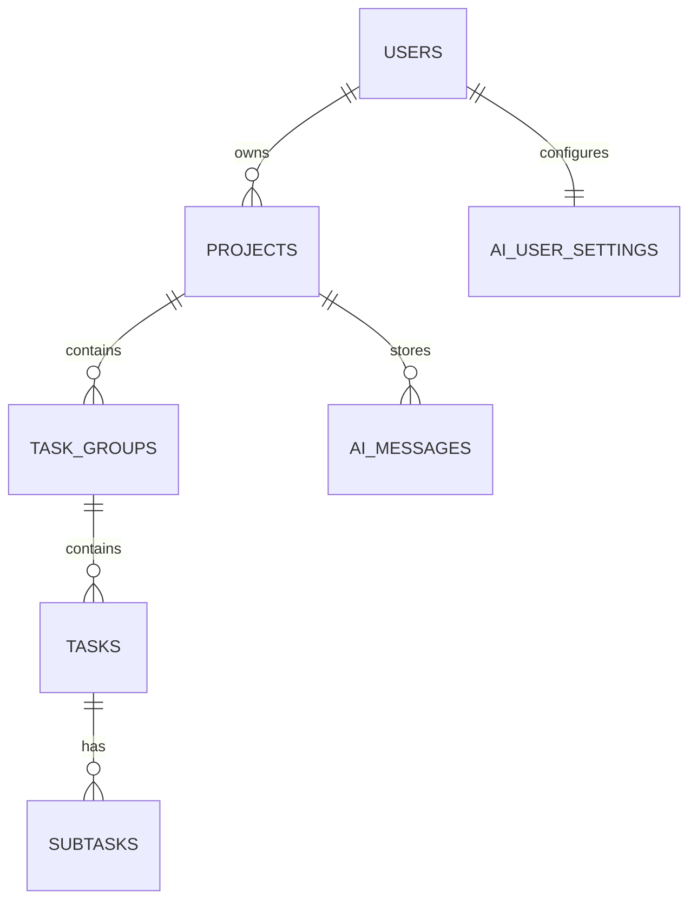
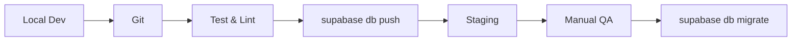

# Supabase Guide  
Commit Coach – Backend Architecture

> **目的** — Supabase を用いた Commit Coach の認証・データ永続化・リアルタイム・ストレージを “設計 → 構築 → 運用” まで一気通貫で説明します。  
> **読者** — バックエンド開発者 / SRE / フルスタックエンジニア

---

## 目次
0. [Architecture & Integration](#0-architecture--integration)  
1. [Setup](#1-setup)  
2. [Transactions](#2-transactions)  
3. [Checklist](#3-checklist)  
4. [更新履歴](#4-更新履歴)  

---

## 0. Architecture & Integration

### 0.1 Supabase アーキテクチャ全体像

```mermaid
graph TD
    Client["Next.js Frontend"]
    Backend["Node.js / Express"]
    SupabaseAuth["Supabase Auth"]
    Postgres["PostgreSQL DB"]
    Storage["Supabase Storage"]
    Realtime["Realtime Subscriptions"]
    RLS["Row Level Security"]
    JWT["JWT Tokens"]
    OpenAI[(OpenAI API)]

    Client -->|Email / OAuth| SupabaseAuth
    SupabaseAuth -->|JWT| Client
    Client -->|REST + JWT| Backend
    Backend -->|supabase-js (service key)| Postgres
    Backend -->|AI queries| OpenAI

    Postgres --> RLS
    Client -- Realtime --> Realtime
    Storage -. optional .- Client
```

### 0.2 Supabase Services

| カテゴリ | 採用機能 | 補足 |
|----------|----------|------|
| **Auth** | Email/PW, GitHub, Google, JWT Refresh | `supabase.auth` |
| **DB** | PostgreSQL + RLS | projects→groups→tasks→subtasks |
| **Storage** | Avatar, Attachments (任意) | S3 互換 API |
| **Realtime** | `channel('projects')` | DnD 同期・通知 |

### 0.3 簡易 ER 図



### 0.4 セキュリティ (RLS)

```sql
CREATE POLICY "Projects owner or admin"
ON public.projects
FOR ALL USING (
  owner_id = auth.uid() OR auth.role() = 'admin'
);
```

### 0.5 Integration Patterns

- **Client**: `createClient(url, anonKey)` → Auth / Query / Storage  
- **Backend**: `service_role_key` でバッチ・AI 集計  
- **Migrations**: `supabase/migrations/*.sql` → CI で `supabase db push`

### 0.6 環境別設定

| 環境 | プロジェクト | ポイント |
|------|--------------|----------|
| Dev  | Free tier / ローカル CLI | CORS open / 試験用 |
| Prod | Pro tier     | RLS 厳格 / バックアップ / IP 制限 |

```env
SUPABASE_URL=https://xxx.supabase.co
SUPABASE_ANON_KEY=public-*
SUPABASE_SERVICE_ROLE_KEY=secret-*
```

### 0.7 Migration Workflow



---

## 1. Setup

### 1.1 プロジェクト作成

1. <https://app.supabase.com> → **New Project**  
2. 入力項目  
   - **Name**: `commit-coach`  
   - **Password**: 生成して 1Password へ  
   - **Region**: user が多いリージョン  
3. 1 分待機 → プロジェクト完成

### 1.2 `.env`

```env
SUPABASE_URL=https://xxxx.supabase.co
SUPABASE_ANON_KEY=ey...
SUPABASE_SERVICE_ROLE_KEY=ey...
```

`.env.example` にはダミーを格納。

### 1.3 Supabase CLI

```bash
npm i -g supabase
supabase init        # 初回
supabase start       # ローカル Docker で DB 起動
```

Studio → <http://localhost:54323>

---

## 2. Transactions

### 2.0 基本原則

1. **ACID** 徹底  
2. **楽観的ロック** で競合検知  
3. **共通エラー + ロギング**

### 2.1 Node.js 明示的トランザクション

```typescript
// services/project.ts
export async function createProjectWithTasks(...) {
  // ① projects 挿入 → ② task_groups → ③ tasks
  // 途中失敗したら順次ロールバック delete
}
```

### 2.2 PostgreSQL 関数

```sql
CREATE FUNCTION create_project_with_tasks(...) RETURNS UUID AS $$
BEGIN
  -- INSERT projects → task_groups → tasks を 1 トランザクションで
  RETURN v_project_id;
END;
$$ LANGUAGE plpgsql;
```

Node から:

```ts
await supabaseAdmin.rpc('create_project_with_tasks', {...});
```

### 2.3 カンバン DnD 順序更新

1. **同一列**: `reorder_tasks_in_group` RPC  
2. **別列**: 元の列を詰め → 新しい列で空ける → タスク更新

### 2.4 エラーハンドリング

| ケース | 対応 |
|--------|------|
| ネットワーク | Exponential Backoff |
| 同時更新 | 楽観ロック → 再取得 |
| レート制限 | 60 秒スリープ再試行 |

---

## 3. Checklist

- [x] Supabase プロジェクト作成  
- [x] `.env` 完了  
- [ ] `supabase start` が動く  
- [ ] RLS ポリシー確認  
- [ ] テストユーザ CRUD 検証  
- [ ] `create_project_with_tasks` 関数を本番 DB に適用  

---

## 4. 更新履歴

| Ver | 日付 | 変更 | 編集者 |
|-----|------|------|--------|
| 1.0 | 2025-04-29 | 初版。Architecture / Setup / Transactions を統合 | backend_team |
```
