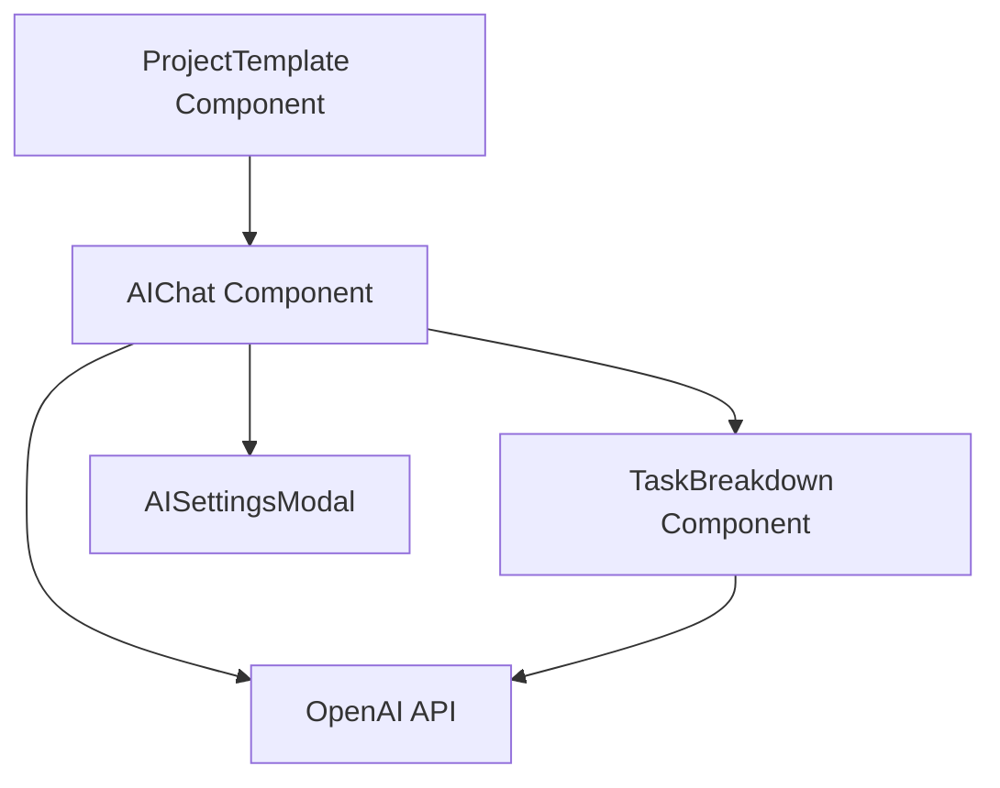
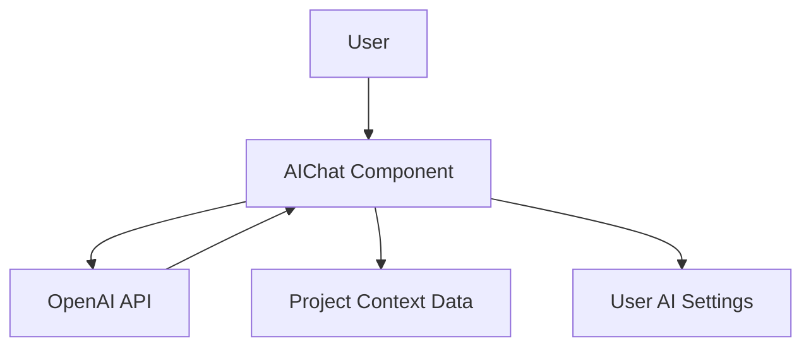
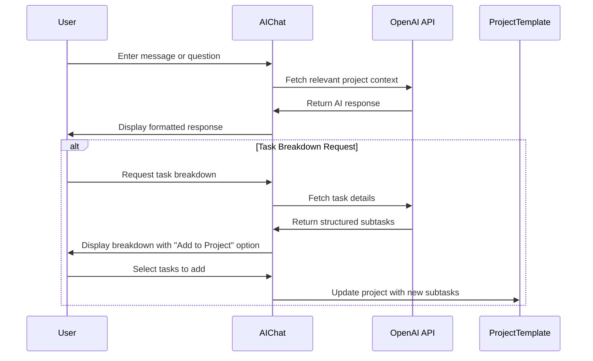
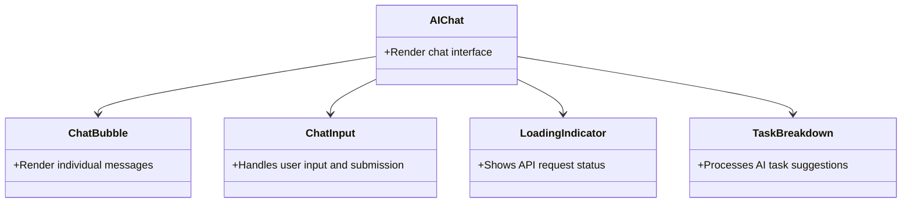
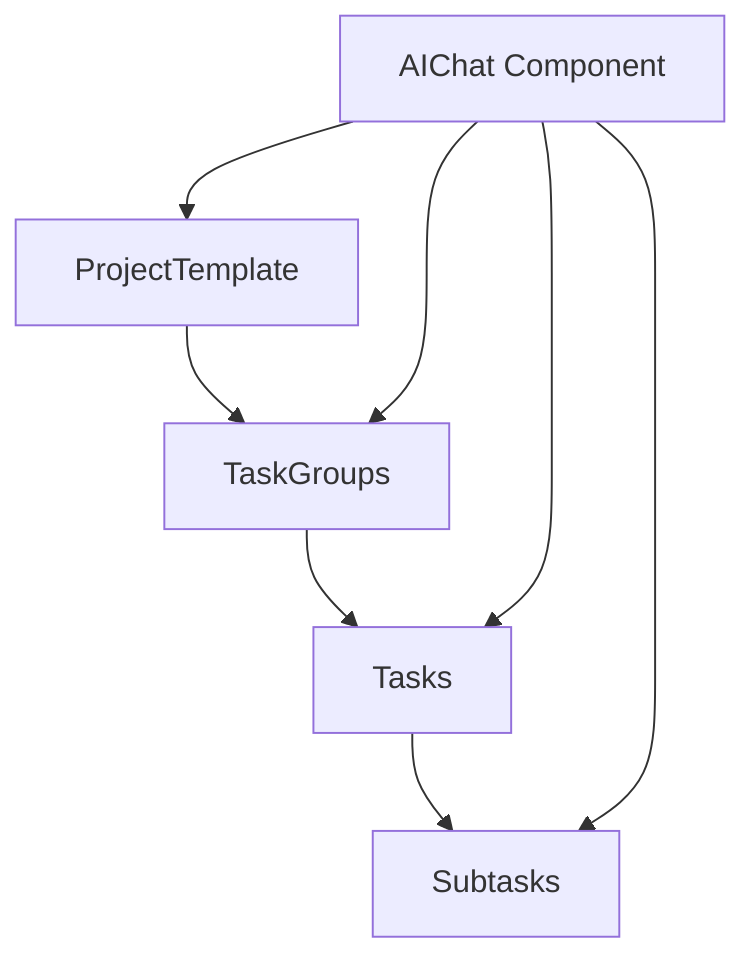

---
title: AI Chat Integration
last_updated: 2025-04-28
---

# Relevant source files
The following files were used as context for generating this wiki page:

- docs/overview/components.md
- frontend/app/projects/project-template.tsx
- frontend/package.json

---

# AI Chat Integration

This document describes the **AI Chat Integration** within the Commit Coach application, detailing how AI coaching functionality is incorporated into the frontend user interface. This integration allows users to receive real-time assistance while managing their tasks and projects. For information about the backend implementation of AI coaching, see **AI Coaching System**.

---

## Overview

The **AI Chat Integration** provides a conversational interface that enables users to receive coaching, task breakdown assistance, and productivity tips while working on their projects. It is implemented as a sidebar component that appears alongside the main project management interface.

### The chat interface supports:

- Real-time messaging with OpenAI-powered AI assistant
- Contextual awareness of the current project
- Persistent conversation history
- Task breakdown suggestions

---
    safe: frontend開発013: fix: ハイドレーションエラーの修正とメタデータの最適化

## Architecture

### Component Integration Diagram



### Data Flow



---

## Interaction Flow

The interaction flow between the user and AI is as follows:



---

## Implementation Details

### AIChat Component

The **AIChat** component renders a chat interface in the project sidebar. It is imported and rendered in the **ProjectTemplate** component.

```html
<div className="w-96 border-l bg-gray-50 p-4">
  <div className="mb-4">
    <h2 className="text-lg font-semibold">AI Coaching</h2>
  </div>
  <AIChat />
</div>
```

This component is designed to:

- Display message history as chat bubbles
- Provide an input field for user messages
- Show loading states during API calls
- Handle error cases gracefully

### Component Structure



---

## Integration with Project Management

### Project Context Access

The AI chat interface is designed to be aware of the current project context, allowing it to provide relevant assistance for:

- The current project being viewed
- Task groups and individual tasks
- Due dates and deadlines
- Project progress and completion status

This contextual awareness enables the AI to give more targeted advice and understand references to specific project elements.



### Task Breakdown Integration

The AI-powered task breakdown functionality allows users to request task decompositions:

1. User selects a task and requests an AI breakdown.
2. AI analyzes the task and suggests logical subtasks.
3. User can review, modify, and accept suggested subtasks.
4. Accepted subtasks are added to the project structure.

This functionality is implemented through specialized prompt engineering that guides the AI in generating structured, actionable subtasks.

---

## User Interaction

### Chat Interface

The chat interface provides:

- A message history display with alternating user and AI messages
- Text input field with send button
- Support for markdown formatting in AI responses
- Loading indicators during API calls

### AI Assistant Capabilities

The AI assistant offers various forms of assistance:

| Feature            | Description                                               | Implementation                          |
|--------------------|-----------------------------------------------------------|------------------------------------------|
| **Task Breakdown**  | Breaks complex tasks into manageable subtasks             | Specialized prompts with structured output |
| **Progress Coaching** | Provides motivation and efficiency tips                   | Context-aware conversation              |
| **Deadline Management** | Offers advice on meeting deadlines                      | Analyzes due dates in project data      |
| **Problem Solving** | Helps overcome obstacles in task completion               | General-purpose coaching dialog         |

---

## Configuration Options

### AI Settings

Users can configure various aspects of the AI assistant through settings:

- **AI model selection** (GPT-3.5, GPT-4)
- **Temperature setting** (controlling creativity/randomness)
- **Coaching style preferences**

These settings are managed through the **AISettingsModal** component, which provides a user interface for adjusting these parameters.

---

## Technical Considerations

### Performance Optimization

The AI chat integration implements several optimizations:

- **Message caching** to reduce duplicate API calls
- **Throttling** to manage API rate limits
- **Progressive loading** of chat history

### Error Handling

The system includes robust error handling for various failure scenarios:

- Network connectivity issues
- API rate limiting
- Token limit exceeded
- Invalid responses

Each error case presents user-friendly messages and appropriate retry options.

---

## Summary

The **AI Chat Integration** provides a seamless way for users to receive AI-powered assistance while managing their projects and tasks. It is tightly integrated with the project management interface, providing contextual awareness that makes the AI responses more relevant and helpful. The system supports both general coaching and specific task breakdown functionality, making it a versatile tool for improving productivity.

---