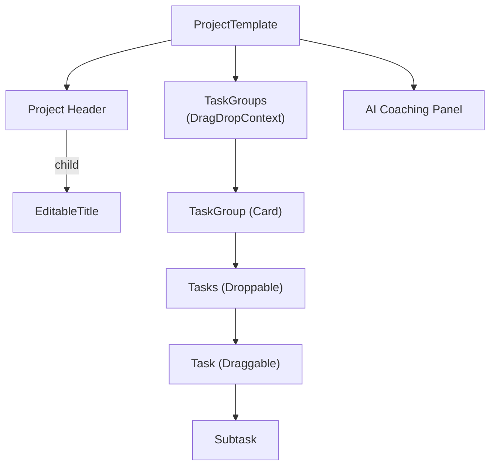
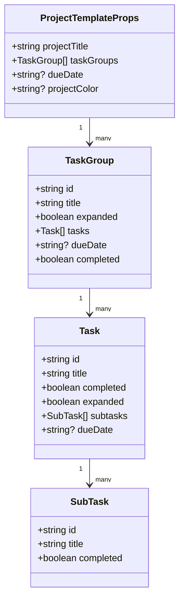
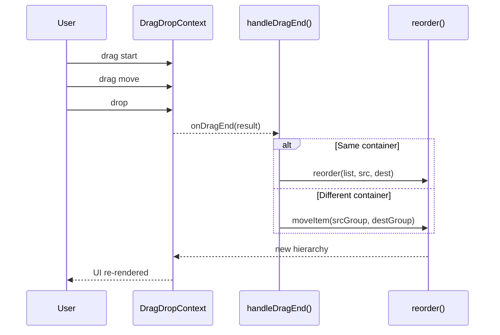

---
title: Frontend Architecture
last_updated: 2025-04-28
---

# Relevant source files

The following files were used as context for generating this wiki page:
- docs/overview/components.md
- frontend/app/projects/project-template.tsx
- frontend/package.json


# Frontend Architecture
This page gives a birds-eye view of the Commit Coach **frontend**.  
For component-level details, see the linked pages below.

## Index

1. [Technology Stack](#technology-stack)  
2. [Component Hierarchy](#component-hierarchy)  
3. [Data Model](#data-model)  
4. [Key UI Patterns](#key-ui-patterns)  
5. [State Management](#state-management)  
6. [Drag & Drop](#drag--drop)  
7. [Design System](#design-system)  
8. [AI Integration](#ai-integration)  

---

## Technology Stack

| Category   | Tech / Version          | Purpose                       |
|------------|-------------------------|-------------------------------|
| Framework  | **Next.js 15.2.4**      | Routing + SSR/CSR             |
| UI         | **React 18.2**          | Component model               |
| Styling    | Tailwind CSS            | Utility-first CSS             |
| Components | shadcn/ui (Radix UI)    | Accessible primitives         |
| DnD        | react-beautiful-dnd     | Task / group reordering       |
| Forms      | react-hook-form + zod   | Form state & validation       |
| Dates      | date-fns                | Formatting & compare          |
| Icons      | lucide-react            | SVG icon library              |

---

## Component Hierarchy



---

## Data Model



---

## Key UI Patterns

* **EditableText** – inline edit-in-place with <kbd>Enter</kbd>/<kbd>Esc</kbd>  
* **DueDate** – red underline when overdue  
* **Checkbox cascade** – toggling a parent propagates to all children  

---

## State Management

| Layer | State Variable(s) | Purpose |
|-------|-------------------|---------|
| Project | `projectTitle`, `projectDueDate`, `projectCompleted` | Top-level meta |
| Groups  | `taskGroups` | Holds full hierarchy |
| UI      | `hovered*`, `showDeleteConfirm`, `sortOrder` | Interaction flags |

*Local state via `useState`; cascading updates handled by  
`updateTaskGroupCompletionStatus`, `updateTaskCompletionStatus`.*  
`useClientSideEffects` defers DnD initialisation to the browser only.

---

## Drag & Drop



*`DragDropContext` wraps project content; nested `Droppable` and `Draggable`  
elements enable both group-level and task-level reordering.*

---

## Design System

* **Colors:** primary `#31A9B8`, accent `#F5BE41`, danger `#CF3721`  
* **Typography:** system font stack, responsive scaling  
* **Spacing:** 8-pt grid, `rounded-2xl` cards  

---

## AI Integration

The sidebar **AIChat** component (see _AI Chat Integration_) provides:

* Task breakdown suggestions  
* Progress coaching & nudges  
* Upcoming-deadline alerts  
* Voice-input (stubbed for future NLP)  

---
```

> Mermaid ブロックは GitHub、DeepWiki、そして MkDocs/Docusaurus＋`remark-mermaid` などでそのままレンダリングされます。図の追加・修正が必要になったら、同じ形で追記してください。