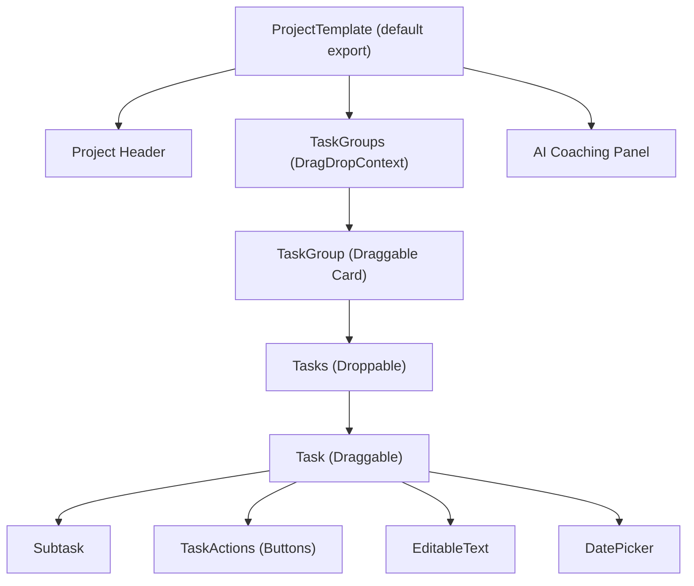
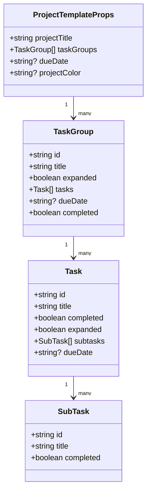
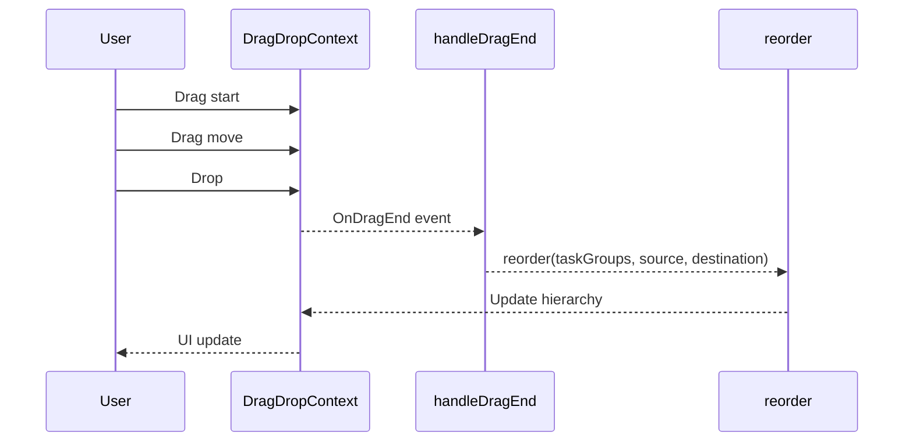

# Relevant source files
The following files were used as context for generating this wiki page:

- frontend/app/projects/project-template.tsx
- frontend/package.json


# ProjectTemplate Component

The `ProjectTemplate` component is the core UI component for project management in the Commit Coach application. It provides a comprehensive interface for managing projects with hierarchical task structures, serving as the main workspace for users to organize, track, and complete their tasks. This component implements key functionality such as drag-and-drop task reordering, completion status tracking, due date management, and AI coaching integration.

For information about the Task Management UI across the application, see **Task Management UI**. For AI chat integration details, see **AI Chat Integration**.

---

## Component Overview

The `ProjectTemplate` component includes the following key sections:

1. **Project Header**
2. **TaskGroups (DragDropContext)**
3. **AI Coaching Panel**

### Main Components



---

## Data Model

The `ProjectTemplate` component manages project data through a hierarchical structure of interfaces:



---

## State Management

The `ProjectTemplate` component manages several key state variables:

| State Variable             | Purpose                              | References |
|----------------------------|--------------------------------------|------------|
| `projectTitle`              | Stores the editable project title    | Lines 190-191 |
| `taskGroups`                | Stores the complete task hierarchy   | Lines 191-200 |
| `projectDueDate`            | Stores the project deadline          | Line 201 |
| `projectCompleted`          | Tracks overall project completion    | Line 202 |
| `sortOrder`                 | Controls task sorting order          | Line 188 |
| `hoveredProject/Group/Task/Subtask` | Tracks UI hover states            | Lines 205-212 |
| `showDeleteConfirm`         | Controls delete confirmation modal   | Line 207 |

---

## Key Functions and Event Handlers

The component implements numerous functions to handle user interactions:

### Task Hierarchy Management Functions

* **Add Functions**:  
  - `addTaskGroup`, `addTask`, `addSubtask`
* **Delete Functions**:  
  - `deleteTaskGroup`, `deleteTask`, `deleteSubtask`
* **Update Functions**:  
  - `updateTaskGroupTitle`, `updateTaskTitle`, `updateSubtaskTitle`

These functions maintain the integrity of the data model while allowing users to build and modify their project structure.

### Completion Status Functions

* **Toggle Functions**:  
  - `toggleProjectCompleted`, `toggleTaskGroupCompleted`, `toggleTaskCompleted`, `toggleSubtaskCompleted`
* **Update Functions**:  
  - `updateTaskGroupCompletionStatus`, `updateTaskCompletionStatus`

### UI Interaction Functions

* **Toggle Functions**:  
  - `toggleTaskGroup`, `toggleTask`
* **Drag-and-Drop Handlers**:  
  - `handleDragEnd`, `reorder`
* **Sorting Function**:  
  - `sortTasksByDueDate`

---

## Drag and Drop Implementation

The `ProjectTemplate` component uses **react-beautiful-dnd** to implement drag-and-drop functionality for task groups and tasks. This allows users to reorder items within a container and move tasks between task groups.



### Scenarios in Drag and Drop

1. **Reordering task groups**
2. **Reordering tasks within the same group**
3. **Moving tasks between different groups**

---

## EditableText Component

The `EditableText` component provides in-place editing functionality for text elements in the UI:

* **onClick**: Activates edit mode  
* **onBlur**: Saves changes when focus is lost  
* **Enter key**: Confirms edit and saves  
* **Escape key**: Cancels editing

---

## Integration with Other Components

The `ProjectTemplate` component integrates with several other components:

| External Libraries | Imported Components |
|--------------------|---------------------|
| **react-beautiful-dnd** | **Task Groups**, **Tasks**, **Subtasks** |
| **Lucide React Icons** | Icons for UI elements |
| **AIChat** | For AI-powered task assistance |
| **Sidebar** | Navigation component |
| **DatePicker** | To select due dates |
| **Button** | For action buttons |

These integrations allow `ProjectTemplate` to be a dynamic, modular component that provides a complete project management experience.

---

## Component Rendering Structure

The `ProjectTemplate` component renders a complex UI structure with the following sections:

* **Outer Container**: Flex layout for screen area
* **Sidebar Component**: Project navigation
* **Main Content Area**: Displays task groups and tasks
* **Project Header**: Editable project title, due date, actions
* **Task Groups List**: Droppable task groups with reordering
* **Tasks**: Nested within groups, draggable with subtasks
* **AI Coaching Panel**: Right sidebar for AI assistance
* **Delete Confirmation Modal**: Conditionally rendered for project deletion

---

## Performance and Technical Considerations

* **Client-Side Rendering**: Uses `useClientSideEffects` hook to ensure drag-and-drop functionality initializes only on the client side.
* **Optimized Hover States**: Hover states are managed to avoid unnecessary re-renders.
* **Deferred Updates**: State updates are deferred using `setTimeout(0)` to ensure proper UI reactivity.
* **Sorting Preservation**: Sorting persists after completion status changes.
* **Date Comparison Logic**: Utility functions like `isDateOverdue()` are used to handle due dates consistently.

---

## Future Integration Points

The component includes placeholders for integrating additional features:

* **Voice Input**: `startVoiceInput()` (lines 774-778)
* **AI Task Decomposition**: `decomposeTask()` (lines 781-784)
* **Dashboard Integration**: Storing data in `localStorage` for future dashboard use (lines 674-746)

---

## Summary

The `ProjectTemplate` component serves as the central workspace for project management in Commit Coach. It combines task management, drag-and-drop functionality, project completion tracking, and AI coaching in a modular way, enabling a seamless and interactive user experience.
```

この Markdown ファイルをそのまま `docs/deepwiki/frontend/02.1-projecttemplate-component.md` に保存すれば、DeepWiki 上で綺麗にレンダリングされます。  
もし図やデザインについてさらに修正したい点があれば教えてください！