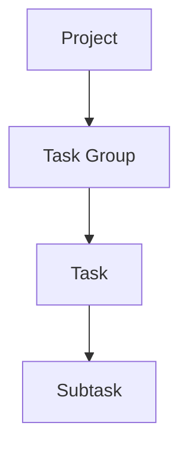
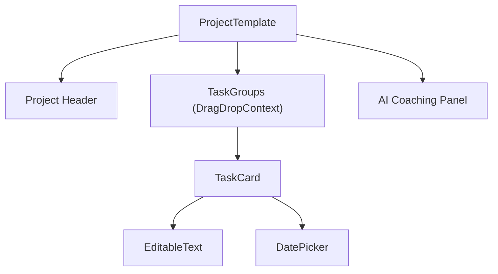
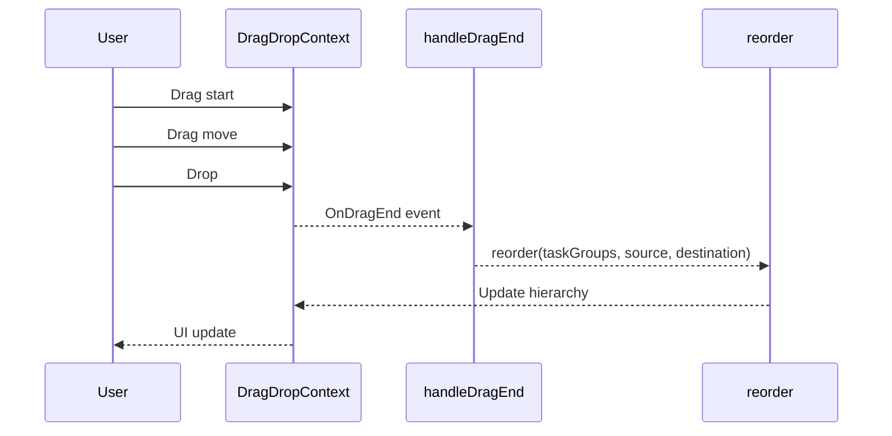

---
title: Task Management UI
last_updated: 2025-04-28
---

# Relevant source files
The following files were used as context for generating this wiki page:
- docs/overview/components.md
- frontend/app/projects/project-template.tsx
- frontend/package.json


# Task Management UI

This document provides detailed information about the **Task Management UI** component in the Commit Coach system. It covers the hierarchical structure of tasks, the UI components used to manage tasks, and the core functionalities for creating, updating, and organizing tasks.

For information about the AI Chat integration within the task management interface, see **AI Chat Integration**.

---

## Overview

The **Task Management UI** provides a comprehensive interface for organizing work through a hierarchical task structure. It allows users to create and manage projects, task groups, tasks, and subtasks, with support for features like completion tracking, due dates, drag-and-drop reordering, and AI-assisted task management.

### Core Hierarchy



---

## Project Template Component

The **ProjectTemplate** component is the main React component that implements the task management UI. It handles the rendering and state management for the entire task hierarchy.

### ProjectTemplate Overview



---

## Drag and Drop Implementation

The Task Management UI implements drag-and-drop functionality using the **react-beautiful-dnd** library, allowing users to reorder task groups and tasks.



### Core DnD Components

The implementation uses three main components from **react-beautiful-dnd**:

* **DragDropContext**: Wraps the entire task management interface
* **Droppable**: Defines areas where items can be dropped
* **Draggable**: Defines items that can be dragged

---

## Key Task Management Functions

The Task Management UI implements numerous functions to handle tasks at all levels of the hierarchy.

### Creation Functions

| Function | Purpose | Implementation |
|----------|---------|----------------|
| `addTaskGroup()` | Creates a new task group | `frontend/app/projects/project-template.tsx` (lines 616-627) |
| `addTask(groupId)` | Creates a new task in a specific group | `frontend/app/projects/project-template.tsx` (lines 630-646) |
| `addSubtask(groupId, taskId)` | Creates a new subtask for a specific task | `frontend/app/projects/project-template.tsx` (lines 649-671) |

### Update Functions

| Function | Purpose | Implementation |
|----------|---------|----------------|
| `updateProjectTitle(newTitle)` | Updates the project title | `frontend/app/projects/project-template.tsx` (lines 495-497) |
| `updateTaskGroupTitle(groupId, newTitle)` | Updates a task group title | `frontend/app/projects/project-template.tsx` (lines 505-509) |
| `updateTaskTitle(groupId, taskId, newTitle)` | Updates a task title | `frontend/app/projects/project-template.tsx` (lines 519-530) |
| `updateSubtaskTitle(groupId, taskId, subtaskId, newTitle)` | Updates a subtask title | `frontend/app/projects/project-template.tsx` (lines 547-567) |

### Completion Toggle Functions

| Function | Purpose | Implementation |
|----------|---------|----------------|
| `toggleProjectCompleted()` | Toggles completion status for the entire project | `frontend/app/projects/project-template.tsx` (lines 364-384) |
| `toggleTaskGroupCompleted(groupId)` | Toggles completion status for a task group | `frontend/app/projects/project-template.tsx` (lines 387-420) |
| `toggleTaskCompleted(groupId, taskId)` | Toggles completion status for a task | `frontend/app/projects/project-template.tsx` (lines 423-464) |
| `toggleSubtaskCompleted(groupId, taskId, subtaskId)` | Toggles completion status for a subtask | `frontend/app/projects/project-template.tsx` (lines 467-492) |

---

## Due Date Management

The Task Management UI includes due date management for projects, task groups, and tasks.

### DatePicker Component

The **DatePicker** component is used to set due dates for:

* Project Due Date
* Task Group Due Date
* Task Due Date

Features include:

* Setting due dates through the DatePicker component
* Visually indicating overdue items (red text, underline)
* Sorting tasks by due date

---

## UI Components in Detail

### Project Header

The project header includes:

* **Project Title**: Editable
* **Project Completion Checkbox**
* **Due Date Picker**
* **Action Buttons**: Delete, Voice Input, AI Decomposition, etc.

### Task Group Card

Each task group is displayed as a card with:

* **Header** with title, completion status, and due date
* **Expandable/Collapsible content**
* **List of tasks**
* **Action buttons**
* **Drag handle** for reordering

### Task Card

Each task is displayed as a card with:

* **Header** with title, completion status, and due date
* **Expandable/Collapsible list of subtasks**
* **Action buttons**
* **Drag handle** for reordering

### Subtask Item

Each subtask is displayed as a list item with:

* **Title**
* **Completion Checkbox**
* **Action buttons**

---

## Special Features

### Inline Text Editing

The Task Management UI implements an **EditableText** component that allows for inline editing of project, task group, task, and subtask titles.

* **Display Mode**: Click to edit
* **Edit Mode**: Press Enter to save, Escape to cancel
* **Blur (click outside)**: Save changes

### Task Sorting

The UI includes functionality to sort tasks by due date:

* Sort order can be ascending or descending
* Completed tasks are always shown at the bottom
* Tasks without due dates are placed below tasks with due dates

---

## AI Integration

The Task Management UI integrates with AI features, including:

* **AI Task Decomposition**
* **Voice Input**

These features integrate with the main **AI Coaching System** (see AI Coaching System).

---

## Data Model

The Task Management UI manages state through the following interfaces:

```typescript
interface SubTask {
  id: string;
  title: string;
  completed: boolean;
}

interface Task {
  id: string;
  title: string;
  completed: boolean;
  expanded: boolean;
  subtasks: SubTask[];
  dueDate?: string;
}

interface TaskGroup {
  id: string;
  title: string;
  expanded: boolean;
  tasks: Task[];
  dueDate?: string;
  completed: boolean;
}
```

---

## Implementation Details

### Visual State Indicators

The UI provides visual feedback for different states:

* **Completed items**: strikethrough and gray text
* **Overdue items**: red text and underline
* **Drag operations**: shadow effect and opacity changes

### Hover States

The UI implements hover states to show/hide action buttons only when hovering over specific items:

* Project actions
* Task group actions
* Task actions
* Subtask actions

---

## Summary

The **Task Management UI** is a comprehensive component that provides a hierarchical, drag-and-drop enabled interface for managing tasks at multiple levels of granularity. It integrates with other components like the **AI Chat** to provide a complete project management experience, while offering features like due date management, completion tracking, and inline editing.

---
```

このMarkdownファイルを`docs/deepwiki/frontend/02.2-task-management-ui.md`として保存すれば、DeepWikiにて綺麗に表示されます。  
さらに質問や修正点があれば、お気軽にお聞きください！