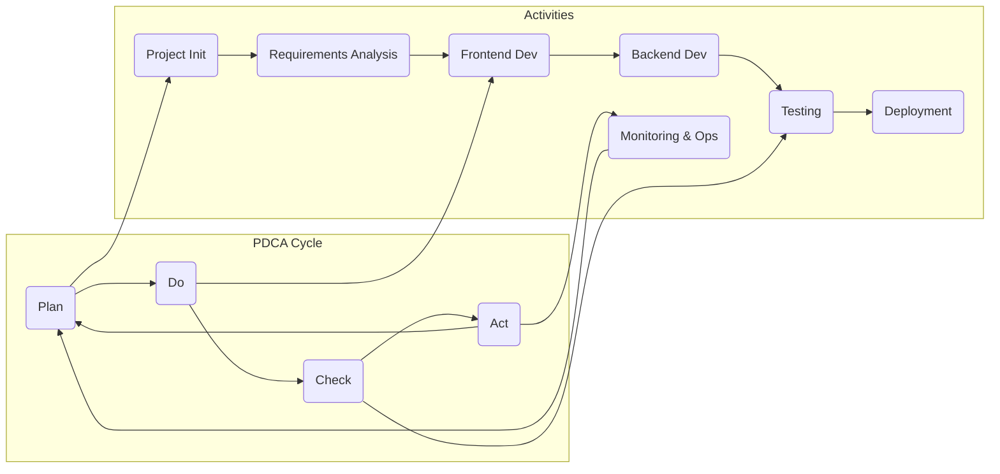
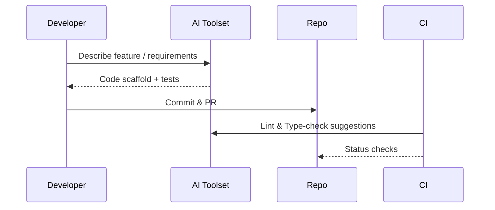
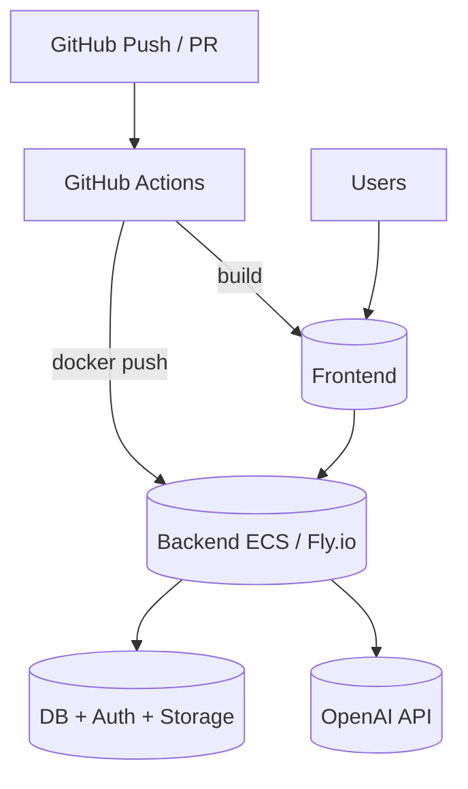

---
title: Development & Deployment
last_updated: 2025-04-28
---

# Development & Deployment

This document describes the development workflow, environment setup, testing strategy, and deployment processes for **Commit Coach**. It combines modern full-stack practices with AI-assisted development and a PDCA-driven methodology.

---

# Relevant source files
The following files were used as context for generating this wiki page:

- .gitignore
- docs/_pdca_prompt.md
- docs/overview/development_flow.md

---

## 1  Development Workflow (PDCA)



* **Plan** – feature planning, task breakdown, risk assessment  
* **Do** – implementation with AI code generation & logging  
* **Check** – unit / integration / E2E tests, reviews  
* **Act** – refinements, knowledge sharing, next iteration planning  

---

## 2  Environment Setup

| Requirement | Version / Note |
|-------------|----------------|
| **Node.js** | Latest LTS |
| **Git** | GitHub repo + GitHub CLI |
| **Editor** | *Cursor* or VS Code (AI plugins) |
| **Supabase** | Project URL + keys |
| **OpenAI** | `OPENAI_API_KEY` |

```bash
git clone https://github.com/ttaarroo77/commit_coach_ver02
cd commit_coach_ver02
pnpm i        # shared lockfile for mono-repo
```

---

## 3  Repository Layout

```text
commit_coach_ver02/
├─ frontend/              # Next.js 15 + Tailwind
│  ├─ app/
│  ├─ components/
│  ├─ hooks/
│  └─ styles/
├─ backend/               # Node.js / Express (service role)
│  ├─ routes/
│  ├─ controllers/
│  ├─ services/
│  └─ models/
├─ docs/                  # DeepWiki sources
│  ├─ overview/
│  ├─ ai_dev_flow/
│  └─ progress_reports_byAI/
└─ supabase/
   └─ migrations/
```

---

## 4  AI-Driven Development Process



* Tools: **Cursor**, **Claude**, **Composer**, `cursorrules` prompts  
* AI generates baseline code → human refinement → AI-generated docs/tests.

---

## 5  Frontend & Backend 100-Step Checklists

| Phase | FE Steps (1–100) | BE Steps (101–200) |
|-------|------------------|--------------------|
| Init  | 1-10 – Next.js, Tailwind, ESLint | 101-110 – Node.ts, Express |
| Auth  | 21-30 – Supabase auth flow       | 131-140 – JWT / middleware |
| Dashboard / API | 31-70 – UI, AI chat    | 141-170 – CRUD, AI endpoints |
| QA    | 81-90 – Jest, Cypress            | 171-180 – Integration tests |
| Deploy| 91-100 – Vercel, CI              | 181-190 – Docker, ECS/Fly |

---

## 6  Deployment Architecture



* **Environments** – dev (auto), staging (manual), prod (manual + checks).  
* **Secrets** stored in GitHub → Actions → runtime env vars.

---

## 7  CI/CD Pipeline

1. **Lint / Type Check** – ESLint, TypeScript  
2. **Tests** – Jest (unit), Supertest (API), Cypress (E2E)  
3. **Build** – `next build` & `docker build`  
4. **Deploy** – Vercel (frontend), Fly.io or ECS (backend)  
5. **Notify** – Slack webhook & GitHub status

---

## 8  Testing Strategy

| Layer      | Tool               | Coverage                        |
|------------|--------------------|---------------------------------|
| Unit       | Jest, RT Library   | Hooks, services, utils          |
| API        | Supertest          | REST routes, validation         |
| E2E        | Cypress            | User flows, auth, DnD           |
| Snapshot   | Jest              | Critical UI components          |
| Perf       | Lighthouse         | LCP, TTI                        |
| Security   | OWASP ZAP / Scan   | Auth, input sanitisation        |

---

## 9  Environment Variables

```env
# frontend
NEXT_PUBLIC_SUPABASE_URL=...
NEXT_PUBLIC_SUPABASE_ANON_KEY=...

# backend
SUPABASE_SERVICE_KEY=...
OPENAI_API_KEY=...
DATABASE_URL=postgresql://...
NODE_ENV=production
```

`.env*` files are **git-ignored**; managed via GitHub Secrets & Vercel/Fly secrets.

---

## 10  Documentation & Reporting

* Each doc file carries front-matter:

```yaml
---
name: "docs/overview/development_flow.md"
title: "Development Flow"
description: "End-to-end workflow reference"
---
```

* AI-generated reports: `YYYY-MM-DD_Project_RPT.md` in `progress_reports_byAI/`.  
* Dev thought logs live in `thinking_logs/`.

---

## Summary

Commit Coach’s development cycle blends **PDCA**, **AI-assisted coding**, and strict CI/CD to ensure fast yet reliable delivery. A clear mono-repo layout, automated tests, and cloud-native deployment keep the team focused on features rather than ops overhead.
```

図は GitHub／DeepWiki／MkDocs で自動描画されます。補足や修正が必要ならお知らせください！